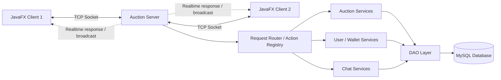

# Hệ Thống Đấu Giá Trực Tuyến


## 1. Mô tả bài toán và phạm vi hệ thống

Dự án mô phỏng một hệ thống đấu giá trực tuyến theo mô hình Client-Server. Người dùng có thể đăng ký, đăng nhập, xem sản phẩm, tham gia đấu giá, theo dõi sản phẩm, quản lý ví tiền và trao đổi qua hệ thống chat. Server xử lý nghiệp vụ đấu giá, đồng bộ dữ liệu, quản lý kết nối TCP Socket và lưu trữ dữ liệu vào MySQL.

Phạm vi chính của hệ thống:

- Ứng dụng Client desktop bằng JavaFX.
- Server xử lý request từ nhiều client qua TCP Socket.
- Cơ sở dữ liệu MySQL lưu người dùng, sản phẩm, giao dịch, phiên đấu giá và tin nhắn.
- Các chức năng đấu giá English Auction, Dutch Auction, auto-bid/proxy bidding, ví tiền, chat và quản trị.

## 2. Công nghệ sử dụng, môi trường chạy và yêu cầu cài đặt

| Thành phần | Công nghệ |
| --- | --- |
| Ngôn ngữ | Java 25 |
| Giao diện | JavaFX, FXML, CSS |
| Build | Maven multi-module |
| Mạng | Java Socket TCP/IP |
| Cơ sở dữ liệu | MySQL 8.0+ |
| Kết nối DB | JDBC, HikariCP |
| Logging | SLF4J, Logback |
| Lưu trữ ảnh | Cloudinary |

Yêu cầu môi trường:

- Cài JDK 25 hoặc mới hơn.
- Cài Maven 3.8+ nếu muốn build từ source.
- Cài MySQL 8.0+ và tạo database cho hệ thống.
- Server phải chạy trước khi mở Client.

## 3. Cấu trúc thư mục và các module chính

```text
Auction_system_javafx/
├── auction-client/       # Client JavaFX, controller, FXML, CSS, service phía giao diện
├── auction-server/       # Server TCP Socket, xử lý nghiệp vụ, DAO, database, auction flow
├── auction-shared/       # Model, request/response, protocol dùng chung giữa client và server
├── Summary/              # Báo cáo, sơ đồ hệ thống và tài liệu tổng hợp
├── pom.xml               # Maven parent project
└── README.md             # Hướng dẫn build, chạy và mô tả dự án
```

Vai trò từng module:

- `auction-client`: hiển thị giao diện người dùng, gửi request tới server, nhận dữ liệu realtime và cập nhật UI.
- `auction-server`: tiếp nhận kết nối client, định tuyến request, xử lý đấu giá, tài khoản, ví tiền, chat và truy cập database.
- `auction-shared`: chứa các class dùng chung như model, request, response và các hằng số protocol.

## 4. Vị trí các file JAR

Các file JAR chạy trực tiếp được đặt tại mục GitHub Releases của repository:

- `client.jar`: chạy ứng dụng Client.
- `server.jar`: chạy Server.

Link Releases:

```text
https://github.com/kduongnguyen150807/Auction_system_javafx/releases
```

Nếu build từ source, file JAR sau khi build nằm trong:

```text
auction-client/target/
auction-server/target/
```

Có thể copy ra thư mục gốc để chạy đúng tên:

```powershell
Copy-Item ".\auction-client\target\auction-client.jar" ".\client.jar" -Force
Copy-Item ".\auction-server\target\auction-server.jar" ".\server.jar" -Force
```

## 5. Hướng dẫn chạy Server/Client theo thứ tự

### 5.1. Chuẩn bị database

Tạo database MySQL:

```sql
CREATE DATABASE auction_db;
```

Cấu hình thông tin kết nối database theo file cấu hình của server hoặc biến môi trường tương ứng:

```text
DB_URL=jdbc:mysql://localhost:3306/auction_db
DB_USER=<tên_đăng_nhập_mysql>
DB_PASS=<mật_khẩu_mysql>
SERVER_PORT=8080
```

### 5.2. Chạy bằng file JAR từ GitHub Releases

Bước 1: tải `server.jar` và `client.jar` trong mục Releases.

Bước 2: mở terminal tại thư mục chứa `server.jar` và chạy server trước:

```powershell
java -jar server.jar
```

Bước 3: mở terminal khác tại thư mục chứa `client.jar` và chạy client:

```powershell
java -jar client.jar
```

Muốn chạy nhiều client, mở nhiều cửa sổ terminal và chạy lại:

```powershell
java -jar client.jar
```

### 5.3. Build và chạy từ source

Tại thư mục gốc của project:

```powershell
mvn clean package -DskipTests
```

Copy JAR ra thư mục gốc:

```powershell
Copy-Item ".\auction-server\target\auction-server.jar" ".\server.jar" -Force
Copy-Item ".\auction-client\target\auction-client.jar" ".\client.jar" -Force
```

Chạy server:

```powershell
java -jar server.jar
```

Chạy client:

```powershell
java -jar client.jar
```

## 6. Danh sách chức năng đã hoàn thành

- Đăng ký, đăng nhập và quản lý phiên người dùng.
- Phân quyền người dùng, bao gồm người mua, người bán và quản trị viên.
- Xem danh sách sản phẩm, xem chi tiết sản phẩm và tìm kiếm sản phẩm.
- Thêm sản phẩm đấu giá, quản lý ảnh và thông tin sản phẩm.
- Đấu giá English Auction.
- Đấu giá Dutch Auction.
- Auto-bid/proxy bidding.
- Watchlist để theo dõi sản phẩm quan tâm.
- Quản lý ví tiền, đặt cọc, giữ tiền, hoàn tiền và ghi nhận giao dịch.
- Chốt phiên đấu giá và cập nhật trạng thái sản phẩm.
- Chat realtime gồm global chat và private chat.
- Quản lý bạn bè/friendship.
- Trang quản trị hệ thống.
- Thống kê, lịch sử đấu giá và biểu đồ giá.
- Logging phục vụ theo dõi lỗi và request trong quá trình chạy.

## 7. Kiến trúc tổng thể

Hệ thống vận hành theo mô hình Client-Server phân tầng. Client JavaFX gửi request qua TCP Socket tới Server. Server định tuyến request tới các handler nghiệp vụ, thao tác với database qua DAO và phản hồi kết quả về Client.



Một số điểm kỹ thuật chính:

- Tách module `client`, `server`, `shared` để giảm phụ thuộc trực tiếp giữa giao diện và nghiệp vụ server.
- Dùng TCP Socket để giao tiếp Client-Server.
- Dùng các request/response dùng chung trong `auction-shared`.
- Dùng cơ chế lock và xử lý giao dịch để hạn chế race condition khi nhiều người cùng đấu giá.
- Dùng background thread và `Platform.runLater()` để tránh chặn UI JavaFX khi gọi mạng.

## 8. Báo cáo PDF và video demo

- Báo cáo PDF: https://drive.google.com/file/d/1pf1j6V50F7uxtXeVZF9_YT36XORGYG4t/view?usp=drive_link
- Video demo: https://drive.google.com/file/d/1f-rXYu2PapCGe3ON3zm6eOxHXkE3EIol/view

## 9. Ghi chú khi chạy chương trình

- Server phải chạy trước Client.
- MySQL phải được bật trước khi chạy Server.
- Nếu sửa cấu hình hoặc tài nguyên trong `src/main/resources`, cần build lại project để JAR nhận thay đổi.
- Nếu muốn test nhiều người dùng, có thể mở nhiều Client cùng lúc.
- Nhánh nộp cuối cùng là `main`.
- Không commit thêm sau deadline theo yêu cầu của giảng viên.
