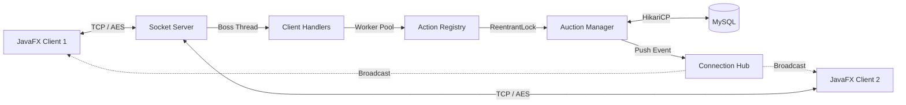

***

# ⚡ Hệ Thống Đấu Giá Trực Tuyến (High-Performance Online Auction System)


Hệ thống mô phỏng một sàn giao dịch đấu giá thời gian thực (Real-time Auction Platform). Lấy cảm hứng từ kiến trúc xử lý I/O của **Netty** và tư duy Clean Architecture của **Iluwatar**, hệ thống được thiết kế để chịu tải cao, xử lý đồng thời hàng ngàn kết nối TCP/IP, giải quyết triệt để bài toán Race Condition trong giao dịch tài chính và tối ưu hóa độ trễ (Latency) bằng các cấu trúc dữ liệu In-memory.

---

## 🏗️ 1. Kiến trúc hệ thống (High-level Architecture)

Hệ thống vận hành theo mô hình **Client-Server phân tầng**, giao tiếp hoàn toàn qua giao thức TCP Socket thuần túy với payload được Serialize.

*   **Boss-Worker Thread Pool (Netty Style):** Tách biệt hoàn toàn luồng chấp nhận kết nối (Boss Thread) và luồng xử lý I/O (Worker Threads). Số lượng Worker được cấp phát dựa trên công thức `Runtime.getRuntime().availableProcessors() * 2`, tối ưu hóa Context Switching của CPU.
*   **Command Dispatcher (Iluwatar Style):** Loại bỏ hoàn toàn `if-else` cồng kềnh. Mọi Request từ Client được định tuyến qua `ActionRegistry` tới các `ActionHandler` độc lập, tuân thủ tuyệt đối nguyên lý Open/Closed (OCP) trong SOLID.
*   **Real-time Push Engine:** Server duy trì một `ClientConnectionHub` (In-memory Registry). Khi có biến động giá, Server chủ động đẩy (Push) gói tin `Response` trực tiếp xuống các Client liên quan thay vì để Client phải Polling gây lãng phí băng thông.



---

## 🗄️ 2. Thiết kế Cơ sở dữ liệu & Công nghệ (Database & Tech Stack)

### Công nghệ cốt lõi
| Lớp (Layer) | Công nghệ / Thư viện áp dụng |
| :--- | :--- |
| **Core / Runtime** | Java (JDK 25), Maven Multi-module |
| **Presentation (UI)** | JavaFX (FXML, CSS Glassmorphism) |
| **Network / Security** | Java Socket (TCP/IP), AES-256 Encryption |
| **Persistence (DB)** | MySQL 8.0+, JDBC thuần (Tối ưu hóa truy vấn) |
| **Connection Pool** | HikariCP (Chống sập Server, quản lý connection lifecycle) |
| **Storage / Logging** | Cloudinary REST API, SLF4J, Logback |

### Cấu trúc Database & Auto-Migration
Hệ thống không yêu cầu chạy script SQL thủ công. Tầng DAO được tích hợp cơ chế **Auto-Migration** (tương tự Flyway/Liquibase thu nhỏ). Khi Server khởi động, hệ thống tự động kiểm tra schema, tạo bảng, thêm cột và đánh Index (B-Tree) cho các trường thường xuyên truy vấn.

**Các thực thể (Entities) chính:**
*   `users`: Lưu thông tin tài khoản, số dư (balance), role (Admin/Seller/Bidder) và metrics thống kê.
*   `items`: Lưu thông tin sản phẩm, giá khởi điểm, giá hiện tại, thời gian kết thúc và loại đấu giá (English/Dutch).
*   `bid_transactions`: Lưu lịch sử đặt giá. Ràng buộc chặt chẽ với `items` và `users`.
*   `transaction_logs`: Sổ cái tài chính (Ledger) ghi nhận mọi biến động số dư (Deposit, Hold, Refund, Sold).
*   `ratings`, `chat_messages`, `friendships`: Các bảng phụ trợ cho hệ sinh thái tương tác người dùng.

---

## 🔥 3. ĐIỂM NHẤN KỸ THUẬT (Technical Highlights)

### 3.1. Tối ưu hóa tìm kiếm: Autocomplete với cấu trúc dữ liệu Trie
> **Vấn đề:** Sử dụng truy vấn `SELECT ... LIKE '%keyword%'` trực tiếp vào Database sẽ gây thắt cổ chai (Bottleneck) nghiêm trọng khi hàng ngàn người dùng gõ phím liên tục.
> **Giải pháp:** Nạp toàn bộ tên sản phẩm vào cấu trúc dữ liệu **Trie (Prefix Tree)** trên RAM của Server. Tốc độ gợi ý từ khóa được giảm từ $O(N)$ của DB Scan xuống chỉ còn $O(L)$ với $L$ là độ dài từ khóa.

```java
public List<String> search(String prefix) {
  List<String> ans = new ArrayList<>();
  trienode curr = root;
  for (char c : prefix.toLowerCase().toCharArray()) {
    curr = curr.children.get(c);
    if (curr == null) {
      return ans;
    }
  }
  dfs(curr, prefix.toLowerCase(), ans);
  return ans;
}
```

### 3.2. Xử lý Concurrent Bidding & Proxy Bidding $O(1)$
> **Vấn đề:** Khi hàng trăm người dùng cùng đặt Auto-bid cho một sản phẩm, việc dùng vòng lặp (while/for) để mô phỏng từng bước giá sẽ gây tràn bộ nhớ và Deadlock.
> **Giải pháp:** 
> 1. Cô lập giao dịch bằng `ReentrantLock` định tuyến theo `itemId`.
> 2. Áp dụng thuật toán **Instant Resolution**: Tính toán điểm giao cắt của các mức giá trần (Max Bid) bằng công thức toán học. Người chiến thắng và mức giá hiện tại được xác định ngay lập tức với độ phức tạp $O(1)$ và chỉ tốn đúng 1 thao tác Database.

```java
public Response process(BidTransaction bid, Item item, User bidder) {
  double targetprice = Math.min(item.getMaxPrice(), bid.getMaxAutoBid()) + bid.getAutoBidIncrement();
  boolean deductres = userdao.atomicDeductBalance(bidder.getId(), targetprice);
  if (!deductres) {
    Response ans = BidAuctionValidator.error("insufficient_balance");
    return ans;
  }
  Response res = new Response("", Response.OK, "success", bid);
  return res;
}
```

### 3.3. Cơ chế chịu tải & Bảo mật (Token Bucket & AES)
*   **Rate Limiting:** Tích hợp thuật toán **Token Bucket** tại tầng `ClientHandler`. Mỗi Client chỉ được cấp một lượng Token nhất định. Các Request vượt ngưỡng (Spam/DDoS) sẽ bị Server từ chối ngay lập tức ở tầng mạng, bảo vệ Business Layer.
*   **Data Security:** Toàn bộ luồng `ObjectOutputStream` và `ObjectInputStream` qua Socket được bọc bởi một lớp mã hóa **AES-256**. Dữ liệu truyền tải trên mạng hoàn toàn miễn nhiễm với các cuộc tấn công Packet Sniffing.

```java
public synchronized boolean tryconsume() {
  long now = System.currentTimeMillis();
  long diff = now - lastrefill;
  if (diff > 100) {
    int add = (int) (diff / 100) * 10;
    tokens = Math.min(max, tokens + add);
    lastrefill = now;
  }
  if (tokens > 0) {
    tokens--;
    boolean ans = true;
    return ans;
  }
  boolean res = false;
  return res;
}
```

### 3.4. Xử lý sự kiện thời gian thực (DelayQueue & Heartbeat)
*   **Zero-Polling Settlement:** Không dùng Timer quét Database mỗi giây để tìm sản phẩm hết hạn. Hệ thống đưa thời gian kết thúc của sản phẩm vào `java.util.concurrent.DelayQueue`. Một Worker Thread duy nhất sẽ bị block và chỉ thức dậy chính xác vào mili-giây sản phẩm đó hết hạn để chốt phiên.
*   **Session Recovery:** Client duy trì một luồng **Heartbeat (Ping/Pong)**. Nếu rớt mạng, Client tự động khởi tạo lại Socket, gửi `SessionToken` lên Server để khôi phục trạng thái đăng nhập mà không làm gián đoạn trải nghiệm người dùng.

### 3.5. Thiết kế UI/UX: Non-blocking & Toast Notification
*   **Thread-Safety UI:** Mọi thao tác I/O (gửi Request, tải ảnh từ Cloudinary) đều bị ép chạy trên Background Threads. Kết quả trả về được đẩy ngược lên UI Thread thông qua `Platform.runLater()`, đảm bảo giao diện JavaFX luôn mượt mà ở 60 FPS.
*   **Custom Toast:** Xây dựng hệ thống Notification Popup nổi độc lập, tự động xếp chồng và có cơ chế Debounce (chống trôi thông báo) khi Server push hàng loạt event cùng lúc.

---

## ⚙️ 4. Hướng dẫn cài đặt & Triển khai

> **Yêu cầu hệ thống:** JDK 25, Maven 3.8+, MySQL 8.0+

### Bước 1: Khởi tạo Database
Tạo một database trống trên MySQL. Hệ thống sẽ tự động chạy Migration để tạo bảng.
```sql
CREATE DATABASE auction_db;
```

### Bước 2: Cấu hình môi trường
Thiết lập các biến môi trường (Environment Variables) cho Server để bảo mật thông tin, tuyệt đối không hardcode:
*   `DB_URL`: `jdbc:mysql://localhost:3306/auction_db`
*   `DB_USER`: `<tên_đăng_nhập_mysql>`
*   `DB_PASS`: `<mật_khẩu_mysql>`
*   `SERVER_PORT`: `8080`

### Bước 3: Build toàn bộ dự án
Tại thư mục gốc của dự án, thực thi lệnh Maven để dọn dẹp và biên dịch cả 3 module (`shared`, `server`, `client`):
```bash
mvn clean verify
```

### Bước 4: Khởi chạy Server
Khởi động lõi xử lý trung tâm. Server sẽ tự động dọn dẹp Port (Auto-kill) nếu bị kẹt từ phiên chạy trước.
```bash
cd auction-server
mvn exec:java -Dexec.mainClass="com.auction.server.Main"
```

### Bước 5: Khởi chạy Client
Mở một Terminal mới và khởi động giao diện JavaFX. Có thể chạy lệnh này nhiều lần để giả lập nhiều người dùng kết nối đồng thời.
```bash
cd auction-client
mvn javafx:run
```
