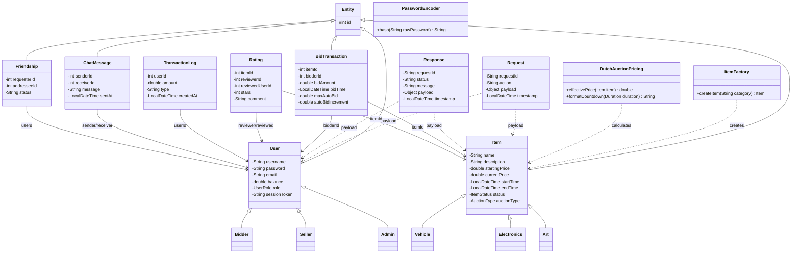
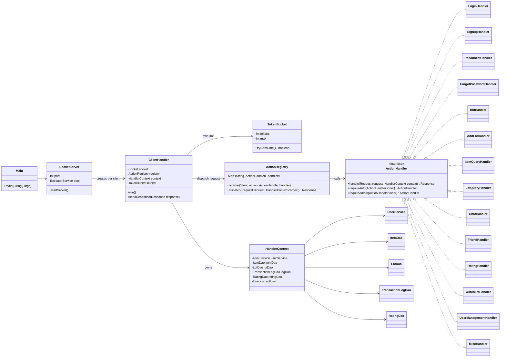
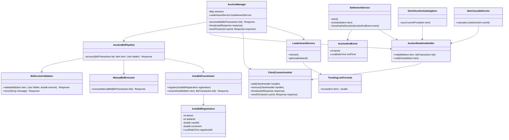
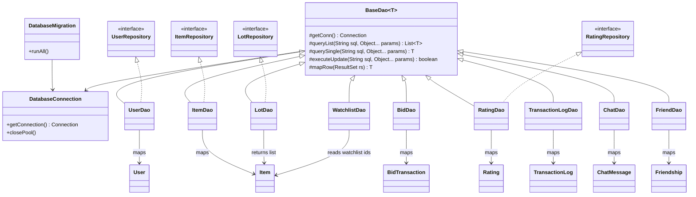
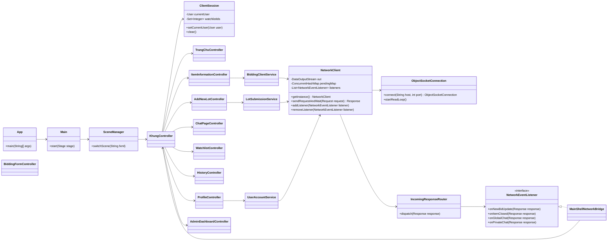
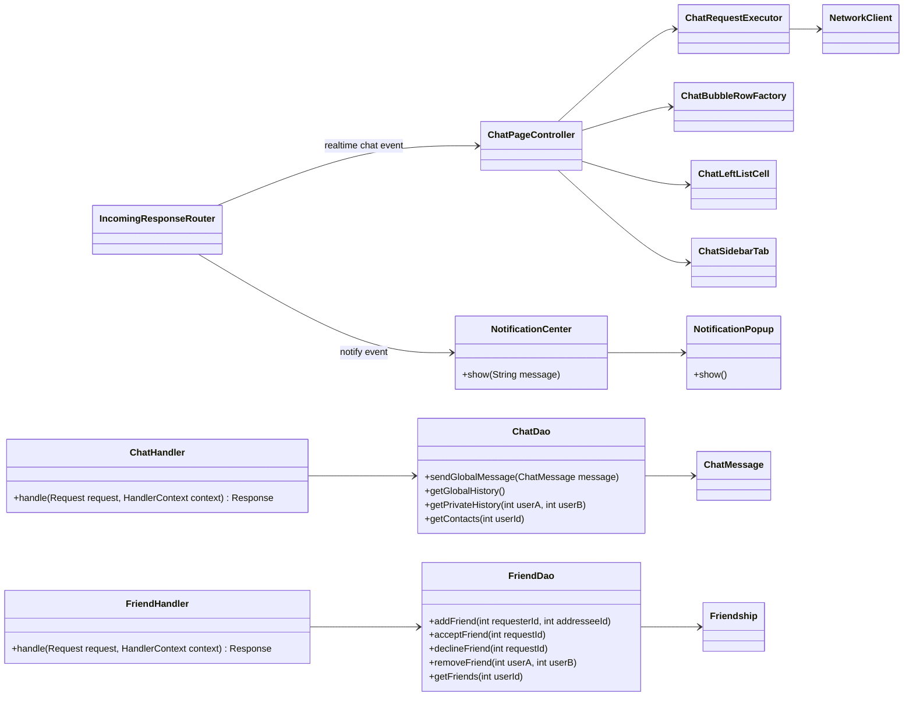

# So do tong the theo tung phan - Auction System JavaFX

Tai lieu nay gom cac so do class diagram tong the, chia theo tung phan cua du an de dua vao bao cao hoac thuyet trinh. Cac so do dung cu phap Mermaid `classDiagram`, co the xem truc tiep tren GitHub Markdown.

---

## 1. Tong the 3 module

```mermaid
classDiagram
direction LR

namespace auction_shared {
  class Request
  class Response
  class User
  class Item
  class BidTransaction
  class ChatMessage
  class Rating
}

namespace auction_client {
  class App
  class Main
  class SceneManager
  class NetworkClient
  class IncomingResponseRouter
  class ClientSession
}

namespace auction_server {
  class ServerMain
  class SocketServer
  class ClientHandler
  class ActionRegistry
  class HandlerContext
  class AuctionManager
  class DatabaseConnection
}

App --> Main
Main --> SceneManager
NetworkClient --> Request : send
IncomingResponseRouter --> Response : route
ClientHandler --> Request : read
ClientHandler --> Response : write
ClientHandler --> ActionRegistry : dispatch
ActionRegistry --> HandlerContext
HandlerContext --> AuctionManager
AuctionManager --> DatabaseConnection
auction_client ..> auction_shared : uses shared model
auction_server ..> auction_shared : uses shared model
```

Y nghia: `auction-shared` la contract chung giua client va server. Client chi hien thi giao dien va gui request. Server nhan request, xu ly nghiep vu, truy cap database va tra response.

---

## 2. Shared domain model



Phan nay dap ung yeu cau OOP trong de bai: co ke thua `User`, `Item`, co dong goi du lieu, co factory tao loai item va cac lop tien ich dung chung.

---

## 3. Server request dispatch va handler



Y nghia: moi request di qua `ClientHandler`, duoc gioi han boi `TokenBucket`, sau do `ActionRegistry` dua ve dung handler. Cac action quan trong duoc boc bang `requireAuth` hoac `requireAdmin`.

---

## 4. Server auction core va realtime



Phan nay the hien cac diem ky thuat de bao ve: auto-bid, concurrent bidding, realtime update, settlement khi het gio, leaderboard va trending lots.

---

## 5. Server DAO va database



Y nghia: chi server duoc truy cap database. `BaseDao` gom logic query chung, cac DAO con map tung bang sang object. Migration dam bao schema duoc tao/cap nhat truoc khi server phuc vu client.

---

## 6. Client JavaFX, network va UI controllers



Y nghia: UI JavaFX duoc chia theo man hinh/controller. Cac controller khong noi thang socket ma di qua service va `NetworkClient`. Realtime update di qua `IncomingResponseRouter` va cac listener.

---

## 7. Chat, friend va notification



Y nghia: chat va friend co day du phan server handler/DAO va phan client UI. Tin realtime duoc router ve UI, dong thoi co notification popup de bao su kien.

---

## 8. Tom tat quan he theo barem

| Barem | Lop/chum lop chinh |
| --- | --- |
| Quan ly nguoi dung | `User`, `Bidder`, `Seller`, `Admin`, `UserDao`, `LoginHandler`, `SignupHandler`, `UserManagementHandler` |
| Quan ly san pham | `Item`, `Vehicle`, `Electronics`, `Art`, `ItemFactory`, `ItemDao`, `AddLotHandler`, `ItemQueryHandler` |
| Tham gia dau gia | `BidTransaction`, `BidHandler`, `AuctionManager`, `AuctionBidPipeline`, `BidAuctionValidator` |
| Ket thuc phien | `SettlementService`, `AuctionEndEvent`, `AuctionRealtimeNotifier`, `TransactionLogDao` |
| Concurrent bidding | `AutoBidCoordinator`, `ManualBidExecutor`, `BidDao`, `ItemDao`, locking/transaction trong service va DAO |
| Realtime update | `ClientConnectionHub`, `AuctionRealtimeNotifier`, `NetworkEventListener`, `IncomingResponseRouter` |
| GUI JavaFX | `SceneManager`, `KhungController`, `TrangChuController`, `ItemInformationController`, `ChatPageController` |
| Database va migration | `DatabaseConnection`, `BaseDao`, `DatabaseMigration`, cac lop `*SchemaMigration` |

