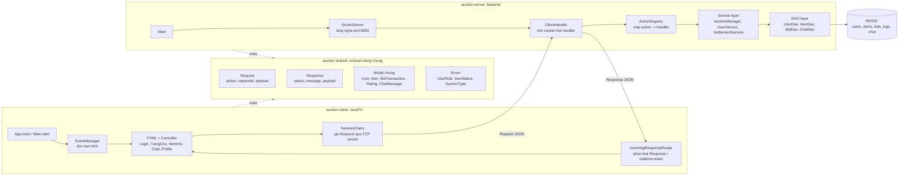
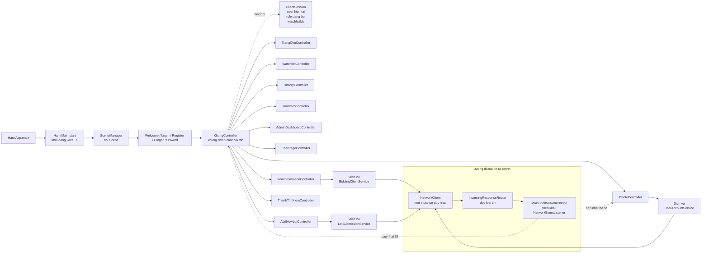
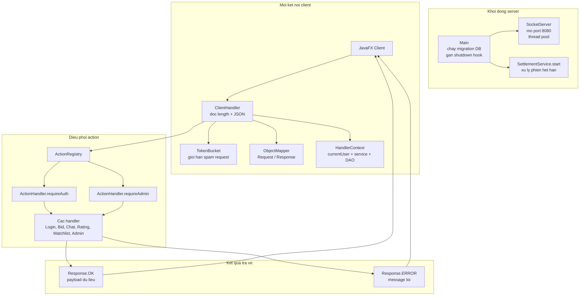
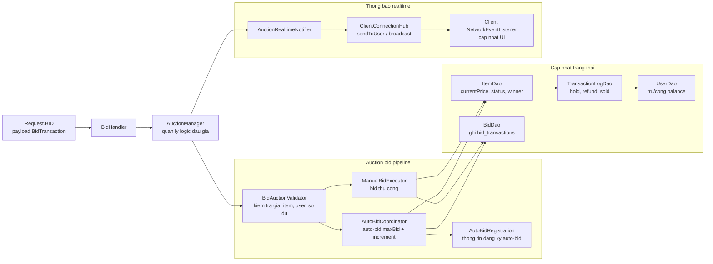
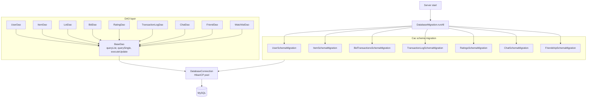
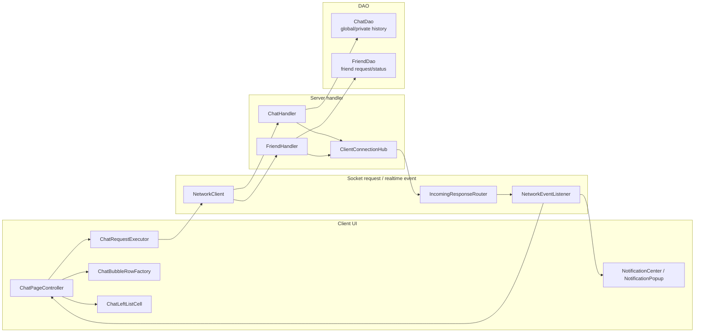
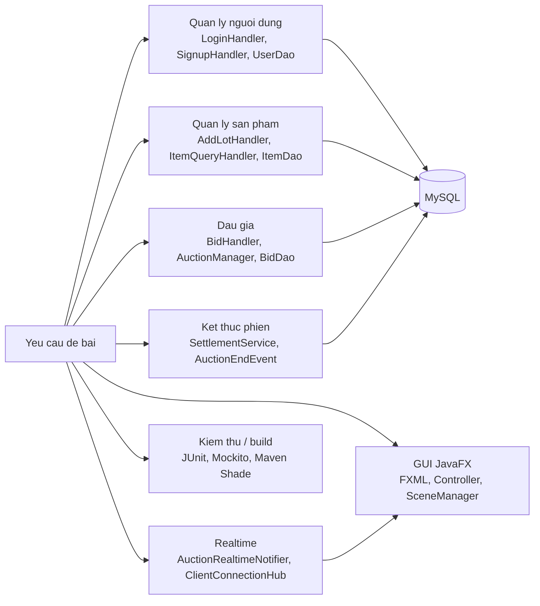

# So do tong the theo tung phan - dang flowchart

File nay ve theo kieu so do hop va mui ten nhu hinh mau. Tat ca so do dung Mermaid `flowchart`, xem truc tiep duoc tren GitHub Markdown.

---

## 1. Tong the he thong

---

## 2. May khach JavaFX `com.auction.client`

---

## 3. Server: tu socket den handler

---

## 4. Server: nghiep vu dau gia

---

## 5. Server: database va migration

---

## 6. Chat, friend va realtime notification

---

## 7. Map nhanh theo chuc nang bao ve

