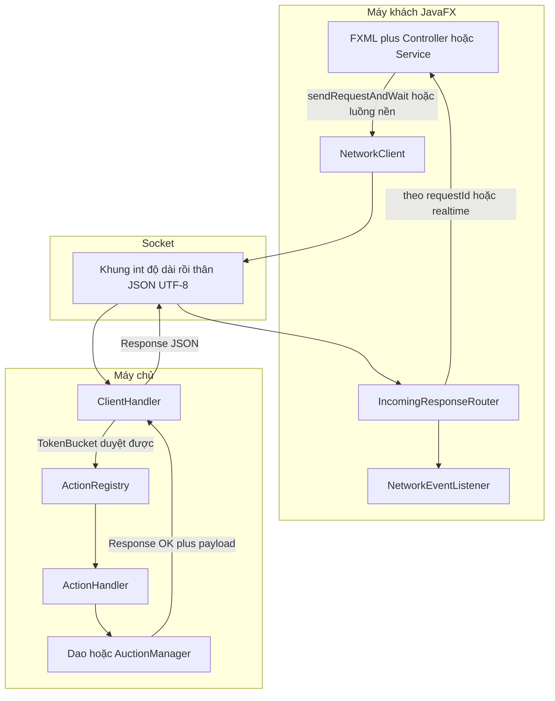

# Luồng xử lý khi dùng giao diện (project-flow)

Tài liệu mô tả **chỉ các thao tác người dùng có trong giao diện JavaFX hiện tại** và **đường đi khi mọi việc đi đúng như thiết kế** — tức server trả **`Response.status` = `SUCCESS`** (hằng số `Response.OK` trong mã) và dữ liệu trả về hoặc tin **push** được xử lý đúng trong client. Không mô tả màn hình lỗi, không liệt kê API server mà giao diện không gửi.

Để xem **kiến trúc tĩnh và lớp chính**, mở [`project-uml.md`](project-uml.md).

---

## 1. Hai cách client nhận `Response` sau khi có kết nối

**A — Trả lời theo lệnh vừa gửi.** Mỗi `Request` sinh `requestId`; server gửi `Response` có **cùng** `requestId`. [`NetworkClient.sendRequestAndWait`](auction-client/src/main/java/com/auction/client/network/NetworkClient.java) chờ `CompletableFuture` được [`IncomingResponseRouter`](auction-client/src/main/java/com/auction/client/network/IncomingResponseRouter.java) hoàn thành sau bước (2).

**B — Server chủ động đẩy (realtime).** Vài gói có `status` đặc biệt; router xử lý **trước** khi gắn với `requestId`. Các nhánh **được cài trong mã** và **có thể** tới UI qua [`NetworkEventListener`](auction-client/src/main/java/com/auction/client/network/NetworkEventListener.java) (listener đăng ký từ khung chính và lớp như `ProfileController`):

| `Response.status` trong router | Payload kỳ vọng | Gọi listener |
|--------------------------------|-----------------|--------------|
| `BALANCE_UPDATE` | `User` | `onBalanceUpdate` |
| `OUTBID_NOTIFY` | `Item` hoặc `Integer` (id) | `onOutbidNotify` |
| `CHAT_GLOBAL` | `ChatMessage` | `onGlobalChat` |
| `CHAT_PRIVATE` | `ChatMessage` | `onPrivateChat` |
| `FRIEND_REQUEST` | `Friendship` | `onFriendRequest` |
| `ITEM_CLOSED` | `Item` | `onItemClosed` |
| `NEW_BID_UPDATE` | `Item` | `onNewBidUpdate` |
| Giá trị `Response.ACCOUNT_BANNED` | (lý do trong `message`) | `onAccountBanned` |
| `LEADERBOARD_UPDATE` | danh sách `LeaderboardEntry` | `onLeaderboardUpdate` |

Mọi callback trên chạy trong **JavaFX Platform thread** (`Platform.runLater` trong router).

---

## 2. Chuỗi chung: từ một thao tác trên màn hình tới server

**Bước mở đầu ứng dụng.** [`Main.start`](auction-client/src/main/java/com/auction/client/Main.java) mở `/fxml/welcome.fxml`. Người dùng chọn Đăng nhập hoặc Đăng ký: lần đầu có lệnh ra server, code gọi **`NetworkClient.getInstance()`** — hộp thoại [`NetworkConnectionUi`](auction-client/src/main/java/com/auction/client/network/NetworkConnectionUi.java) hỏi **IP**, rồi mở TCP tới cổng **8080** và chạy luồng đọc trả lời liên tục.

**Luồng nền.** Cứ khoảng 5 giây, nếu socket còn hoạt động client gửi `Request.PING` không qua nút bấm (`MiscHandler` trên server đáp **thành công** khi đăng ký). Nếu mất kết nối client thử nối lại; nếu người đang đăng nhập có `sessiontoken`, gửi `RECONNECT`, khi **không** `OK` thì gọi **`KhungController.performForcedLogoutFromServer()`**.

---

## 3. Màn không cần phiên — Welcome, Đăng ký, Đăng nhập, Quên mật khẩu

### 3.1 Welcome (`welcome.fxml` — [`WelcomeController`](auction-client/src/main/java/com/auction/client/controller/WelcomeController.java))

Chỉ chuyển cảnh sang `login.fxml` hoặc `register.fxml`. Không gọi server.

### 3.2 Đăng ký (`register.fxml` — [`RegisterController`](auction-client/src/main/java/com/auction/client/controller/RegisterController.java))

Người dùng điền form hợp lệ → xây **`Bidder`**, mật khẩu **`PasswordEncoder.hash`**, gửi **`Request(Request.SIGNUP, newUser)`** → server **`SignupHandler`**. Khi trả **`SUCCESS`**, ứng dụng **`SceneManager.switchScene("/fxml/login.fxml")`**.

### 3.3 Đăng nhập (`login.fxml` — [`LoginController`](auction-client/src/main/java/com/auction/client/controller/LoginController.java))

Người dùng nhập tài khoản mật khẩu → mật khẩu được **băm SHA-256** trên máy khách → **`Request(Request.LOGIN, map username password_hash)`** → **`LoginHandler`** gọi **`UserService.login`**, sinh **`sessiontoken`**, **`AuctionManager.registersession`**, gắn **`context.setCurrentUser`**, trả **`User`**.

Khi **`SUCCESS`**: **`ClientSession.setCurrentUser`**, luồng nền gửi **`GET_WATCHLIST`**, nếu **`SUCCESS`** thì **`ClientSession.setWatchlist`**, rồi chuyển **`/fxml/main/Khung.fxml`**.

### 3.4 Quên mật khẩu (`forgot_password.fxml` — [`ForgotPasswordController`](auction-client/src/main/java/com/auction/client/controller/ForgotPasswordController.java))

**Bước 1:** **`Request.FORGOT_PASSWORD_REQ`** với email → **`ForgotPasswordHandler`** cùng **`OtpService`** (gửi OTP thành công theo logic server).

**Bước 2:** Người dùng nhập OTP và mật khẩu mới → **`Request.FORGOT_PASSWORD_RESET`** → cùng handler cập nhật mật khẩu đã băm trong database khi hợp lệ.

---

## 4. Khung chính sau đăng nhập (`main/Khung.fxml` — [`KhungController`](auction-client/src/main/java/com/auction/client/ui/Main/KhungController.java))

Các tab mở các vùng nhúng khác (Trang chủ, Lịch sử, Theo dõi, Sản phẩm của tôi, Hồ sơ, Quản trị nếu admin, Chat, Thêm lot, v.v.). **`MainShellNetworkBridge`** đăng ký listener để cập nhật danh sách đấu giá, giá, chat, bảng xếp hạng, v.v. khi nhận các `status` realtime ở mục 1.

**Chuyển vai trò Bidder hoặc Seller** là thuần **`ClientSession.toggleRole()`** (không có gói tin `Request` trong mã hiện tại).

---

## 5. Trang chủ và bảng xếp hạng (`trangchu/TrangChu.fxml` — [`TrangChuController`](auction-client/src/main/java/com/auction/client/ui/TrangChu/TrangChuController.java) và [`TrangChuOngoingItemsLoader`](auction-client/src/main/java/com/auction/client/ui/TrangChu/TrangChuOngoingItemsLoader.java))

Khi vào tab đấu giá / làm mới:

- **`GET_ONGOING_BIDS`** với `userId` (**0** nếu `ClientSession` không có user) → **`LotQueryHandler`** → danh sách **`Item`** đang đấu (sau khi đồng bộ giá Dutch trong handler nếu cần).

- **`GET_TRENDING_LOTS`** với chuỗi loại catalog **`ENGLISH`/`DUTCH`** do tab trên khung chọn → **`LotQueryHandler`** → tối đa 5 lot “trending” theo loại.

Khi bấm **làm mới bảng xếp hạng**:

- **`GET_LEADERBOARD`** → **`LeaderboardHandler`** → danh sách **`LeaderboardEntry`**, vẽ trong **`updateleaderboardui`**.

Khi bấm vào **một dòng leaderboard**:

- **`GET_USER_BY_ID`** với id người chơi → **`UserManagementHandler`** → nhận **`User`**, gọi **`KhungController.showUserProfile(u)`** để mở màn hồ sơ người khác.

Việc đổi tab **English auctions / Dutch auctions** trên Trang chủ cập nhật **`KhungController.setCatalogAuctionType`**, sau đó logic refresh dùng **`GET_TRENDING_LOTS`** với **`AuctionType.dbName()`** tương ứng.

---

## 6. Danh sách theo dõi trong Lịch sử (`history/History.fxml` — [`HistoryController`](auction-client/src/main/java/com/auction/client/ui/History/HistoryController.java))

Khi mở hoặc **`refreshHistory`** (có user):

- **`GET_WATCHLIST_ITEMS`** → **`LotQueryHandler`** → danh sách **`Item`** trên watchlist, vẽ ô thẻ.

- **`GET_UPCOMING_BIDS`**, **`GET_CLOSED_BIDS`** (hằng `getclosedbids`), **`GET_PAST_BIDS`** (`getpastbids`) với id user → cùng **`LotQueryHandler`** → các cột ** upcoming / closed / past **.

- **`GET_TRENDING_LOTS`** theo loại catalog hiện chọn (song song với Trang chủ) cho vùng trending trong màn lịch sử.

---

## 7. Trang Watchlist riêng (`watchlist/Watchlist.fxml` — [`WatchlistController`](auction-client/src/main/java/com/auction/client/ui/Watchlist/WatchlistController.java))

Gửi **`GET_WATCHLIST_ITEMS`** với id user → **`LotQueryHandler`** → hiển thị lưới thẻ phiên đang theo dõi.

---

## 8. Sản phẩm của tôi (`youritem/YourItem.fxml` — [`YourItemController`](auction-client/src/main/java/com/auction/client/ui/YourItem/YourItemController.java))

Gửi **`get_my_items`** (cùng giá trị với **`Request.GET_MY_ITEMS`**) với id seller → **`ItemQueryHandler`** → danh sách **`Item`**, lọc và vẽ.

---

## 9. Chi tiết phiên, đặt giá, đánh giá

### 9.1 Phần nhúng chi tiết (`iteminformation/ItemInformation.fxml` — [`ItemInformationController`](auction-client/src/main/java/com/auction/client/ui/ItemInformation/ItemInformationController.java) + [`BiddingClientService`](auction-client/src/main/java/com/auction/client/service/BiddingClientService.java))

- **`GET_ITEM_BY_ID`** → **`ItemQueryHandler`** → một **`Item`** đầy đủ để hiển thị và biểu đồ.

- **`GET_BID_HISTORY`** → **`MiscHandler`** → danh sách **`BidTransaction`** cho biểu đồ giá.

- **`GET_RATINGS`** và **`SUBMIT_RATING`** → **`RatingHandler`** (submit cần phiên đăng nhập đã gắn **`requireAuth`**).

- **`BID`** kèm **`BidTransaction`** → **`BidHandler`** → **`AuctionManager.processBid`**. Khi xử lý thành công, server có thể phát **`NEW_BID_UPDATE`** / **`OUTBID_NOTIFY`** / **`BALANCE_UPDATE`** tùy logic đấu giá và thông báo.

### 9.2 Biểu mẫu đặt (`biddingform/BiddingForm.fxml` — [`BiddingFormController`](auction-client/src/main/java/com/auction/client/ui/BiddingForm/BiddingFormController.java))

Gọi vào **`BiddingClientService.placeBid`** như trên (**`Request.BID`**).

### 9.3 Đánh giá (`ratingform/RatingForm.fxml` — [`RatingFormController`](auction-client/src/main/java/com/auction/client/ui/RatingForm/RatingFormController.java))

Gửi **`SUBMIT_RATING`** với **`Rating`** qua cùng service.

### 9.4 Thẻ ô vuông trong danh sách (`itemcard/ItemCard.fxml` — [`ItemCardController`](auction-client/src/main/java/com/auction/client/ui/ItemCard/ItemCardController.java))

Người dùng có thể bật tắt theo dõi: **`Request.TOGGLE_WATCHLIST`** (payload map id phiên và trạng thái) → **`WatchlistHandler`**. Khi **OK**, mã trong controller cập nhật **`ClientSession.toggleWatch`** và giao diện.

---

## 10. Xem và hồ sơ người khác (`userprofile/UserProfile.fxml` — [`UserProfileController`](auction-client/src/main/java/com/auction/client/ui/UserProfile/UserProfileController.java))

Đọc **sản phẩm của user đích** qua **`get_my_items`** với **`targetUser.getId()`** và **`GET_USER_BY_ID`** khi cần — cùng **`ItemQueryHandler`** / **`UserManagementHandler`**; khi **`SUCCESS`** dữ liệu hiển thị trong màn cuộn.

---

## 11. Đặt phiên và sửa khi chờ duyệt (`addnewlot/AddNewLot.fxml` — [`AddNewLotController`](auction-client/src/main/java/com/auction/client/ui/AddNewLot/AddNewLotController.java) + [`LotSubmissionService`](auction-client/src/main/java/com/auction/client/service/LotSubmissionService.java))

Upload ảnh dùng **`NetworkClient.uploadFile`** tới endpoint Cloudinary (HTTP tách khỏi socket), nhận **URL**.

Gửi lot mới:** **`ADD_LOT`** payload map (**`Serializable`**) → **`AddLotHandler`**.

Sửa lot **PENDING`:** **`SELLER_UPDATE_PENDING_ITEM`** → **`SellerUpdatePendingItemHandler`**.

Huỷ (seller): **`SELLER_CANCEL_ITEM`** với map chứa `itemid` → **`SellerCancelItemHandler`**.

Cả ba đều đi qua bọc **`requireAuth`** đã đăng ký trong [`ClientHandler.buildRegistry`](auction-server/src/main/java/com/auction/server/controller/ClientHandler.java).

---

## 12. Hồ sơ và ví (`profile/Profile.fxml` — [`ProfileController`](auction-client/src/main/java/com/auction/client/ui/Profile/ProfileController.java) + [`UserAccountService`](auction-client/src/main/java/com/auction/client/service/UserAccountService.java))

- **Nạp tiền:** **`DEPOSIT`** payload map chứa `userId`, `amount` → **`DepositHandler`**.

- **Cập nhật hồ sơ:** **`UPDATE_PROFILE`** → **`UpdateProfileHandler`**. Khi thành công service gọi **`ClientSession.applyProfileUpdate`** và **`KhungController.refreshSidebarFromSession`**.

- **Avatar:** **`UPDATE_AVATAR`** chuỗi **`username và URL`** → **`UpdateAvatarHandler`**.

- **Làm mới user từ server:** **`REFRESH_USER`** id → **`MiscHandler`** trả **`User`**.

Controller gắn **`NetworkEventListener`** để khi **`BALANCE_UPDATE`** cập nhật trực tiếp ô số dư.

**“Xem lịch sử giao dịch”** trong hồ sơ mở `/fxml/history/TransactionHistory.fxml`.

---

## 13. Lịch sử giao dịch ví (`history/TransactionHistory.fxml` — [`TransactionHistoryController`](auction-client/src/main/java/com/auction/client/ui/TransactionHistory/TransactionHistoryController.java))

Gửi **`get_transactions`** (hằng **`Request.GET_TRANSACTIONS`**) kèm id user → **`MiscHandler`** trả **`List<TransactionLog>`**, đổ bảng JavaFX.

---

## 14. Thanh tìm kiếm (`searchbar/ThanhTimKiem.fxml` — [`ThanhTimKiemController`](auction-client/src/main/java/com/auction/client/ui/SearchBar/ThanhTimKiemController.java))

- **Autocomplete tên phiên:** gõ ô tìm **`Request.AUTOCOMPLETE`** prefix → **`AutocompleteHandler`** (**TrieManager**).

- **Tìm người dùng:** **`SEARCH_USERS`** từ khoá → **`UserManagementHandler`**, hiển thị popup để mở hồ sơ.

Điều kiện lọc giá và loại được áp vào các lần refresh của **Trang chủ / Sản phẩm của tôi / Khung** thông qua **`KhungController.applySearchFilter`** (chuỗi không phải thêm **`Request`** mới trong `ThanhTimKiem`; bộ lọc dùng tại chỗ trên **`Item`** đã tải).

---

## 15. Quản trị (`main/AdminDashboard.fxml` — [`AdminDashboardController`](auction-client/src/main/java/com/auction/client/ui/Main/AdminDashboardController.java))

Các nút và bảng gọi qua **`asyncRequest`** (luồng nền) rồi **`sendRequestAndWait`**:

- **`GET_ALL_USERS`** — danh người dùng (**`requireAdmin`** về phía server).

- **`GET_PENDING_ITEMS`** — sản phẩm chờ duyệt.

- **`get_status_stats`**, **`get_category_stats`** (hằng **`GET_STATUS_STATS`**, **`GET_CATEGORY_STATS`**) → **`MiscHandler`** + **`ItemDao`**.

- Khóa mở: **`LOCK_USER`**, **`UNLOCK_USER`** tên đăng nhập.

- **Đổi vai admin:** **`PROMOTE_ADMIN`** chuỗi **`username:role`** theo định dạng controller.

- Duyệt từ chối phiên chờ:** **`APPROVE_ITEM`** / **`REJECT_ITEM`** id phiên.

Tất cả đều nằm trong [`ClientHandler.buildRegistry`](auction-server/src/main/java/com/auction/server/controller/ClientHandler.java) với **`requireAdmin`**.

---

## 16. Chat và bạn bè (`chat/ChatPage.fxml` — [`ChatPageController`](auction-client/src/main/java/com/auction/client/ui/Chat/ChatPageController.java))

- **`SEARCH_USERS`** trong ô tìm (trùng cụm 14).

- **`GET_GLOBAL_CHAT_HISTORY`** và **`GET_PRIVATE_CHAT_HISTORY`** tải lịch sử.

- **`SEND_CHAT`** với **`ChatMessage`** (**`ChatRequestExecutor.submitAsync`**, không chờ **`sendRequestAndWait`** trực tiếp trên nút nhưng vẫn qua **`NetworkClient`**). Khi gửi thành công, các client khác nhận **`CHAT_GLOBAL`** hoặc **`CHAT_PRIVATE`** (mục 1).

**Bạn bè**

- **`GET_FRIENDS`**, **`GET_FRIEND_REQUESTS`** danh sách và lời mời (**`FriendHandler`** cho GET khi không bọc auth theo đăng ký — chỉ các lệnh thao tác được bọc auth).

- **`ADD_FRIEND`**, **`ACCEPT_FRIEND`**, **`DECLINE_FRIEND`** qua **`ChatRequestExecutor.submitAsync`** hoặc chờ (**`FriendHandler`** với bọc **`requireAuth`** cho thao tác ghi).

Khi có lời mời đến, server có thể push **`FRIEND_REQUEST`** (mục 1).

---

## 17. Mapping nhanh: lệnh từ giao diện → handler (thành công có đăng ký server)

|Từ máy khách vào được (ví dụ màn có gửi) | Handler server trong `buildRegistry()` |
|-------------------------------------------|----------------------------------------|
| `LOGIN`, `SIGNUP`, `RECONNECT`, `AUTOCOMPLETE` | Login, Signup, Reconnect, Autocomplete |
| `GET_ONGOING_BIDS`, `GET_TRENDING_LOTS`, `GET_UPCOMING_BIDS`, `GET_CLOSED_BIDS`, `GET_PAST_BIDS`, `GET_WATCHLIST_ITEMS` | `LotQueryHandler` |
| `FORGOT_PASSWORD_REQ`, `FORGOT_PASSWORD_RESET` | `ForgotPasswordHandler` |
| `GET_MY_ITEMS`, `GET_ITEM_BY_ID`, `GET_PENDING_ITEMS`, `APPROVE_ITEM`, `REJECT_ITEM` | `ItemQueryHandler` (pending và duyệt có `requireAdmin`) |
| `GET_RATINGS`, `SUBMIT_RATING` | `RatingHandler` |
| `REFRESH_USER`, `GET_TRANSACTIONS`, `GET_BID_HISTORY`, `PING`, `GET_STATUS_STATS`, `GET_CATEGORY_STATS` *(hai stats admin)* | `MiscHandler` |
| `GET_GLOBAL_CHAT_HISTORY`, `GET_PRIVATE_CHAT_HISTORY`, `SEND_CHAT` | `ChatHandler` |
| `GET_WATCHLIST`, `TOGGLE_WATCHLIST` | `WatchlistHandler` |
| `GET_ALL_USERS`, `SEARCH_USERS`, `GET_USER_BY_ID`, `LOCK_USER`, `UNLOCK_USER`, `PROMOTE_ADMIN` | `UserManagementHandler` (một phần `requireAdmin`) |
| `GET_FRIENDS`, `GET_FRIEND_REQUESTS` | `FriendHandler` |
| `ADD_FRIEND`, `ACCEPT_FRIEND`, `DECLINE_FRIEND` | `FriendHandler` với **`requireAuth`** |
| `BID`, `ADD_LOT`, `SELLER_CANCEL_ITEM`, `SELLER_UPDATE_PENDING_ITEM` | `Bid`, `AddLot`, các `Seller*` |
| `UPDATE_PROFILE`, `UPDATE_AVATAR`, `DEPOSIT` | Các handler user |

---

*Tài liệu này giới hạn ở giao diện và **`Response.SUCCESS`** và luồng push đã khai báo trong `IncomingResponseRouter`. Khi chỉnh thêm FXML hay `reg.register`, đổi song song trong file này.*
