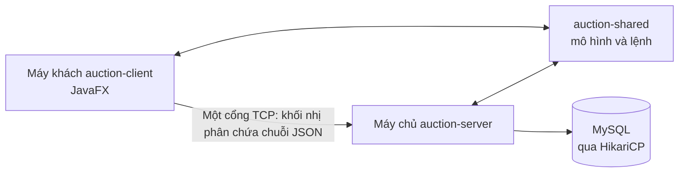
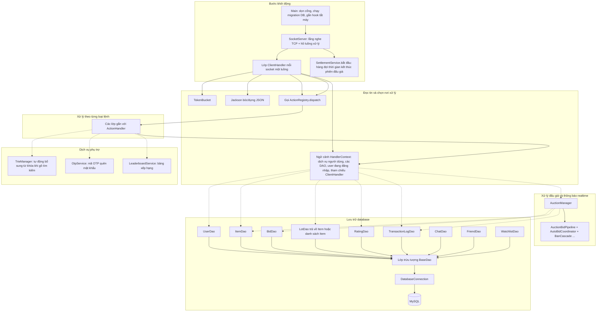
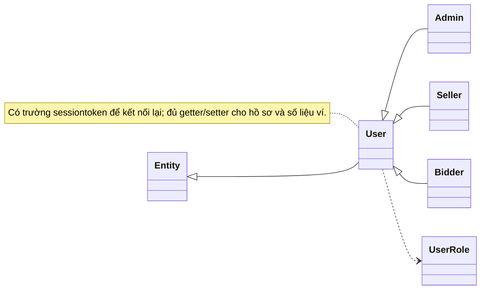
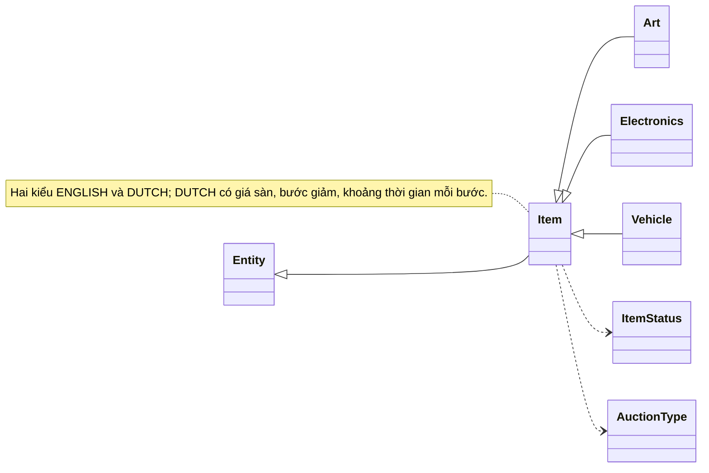
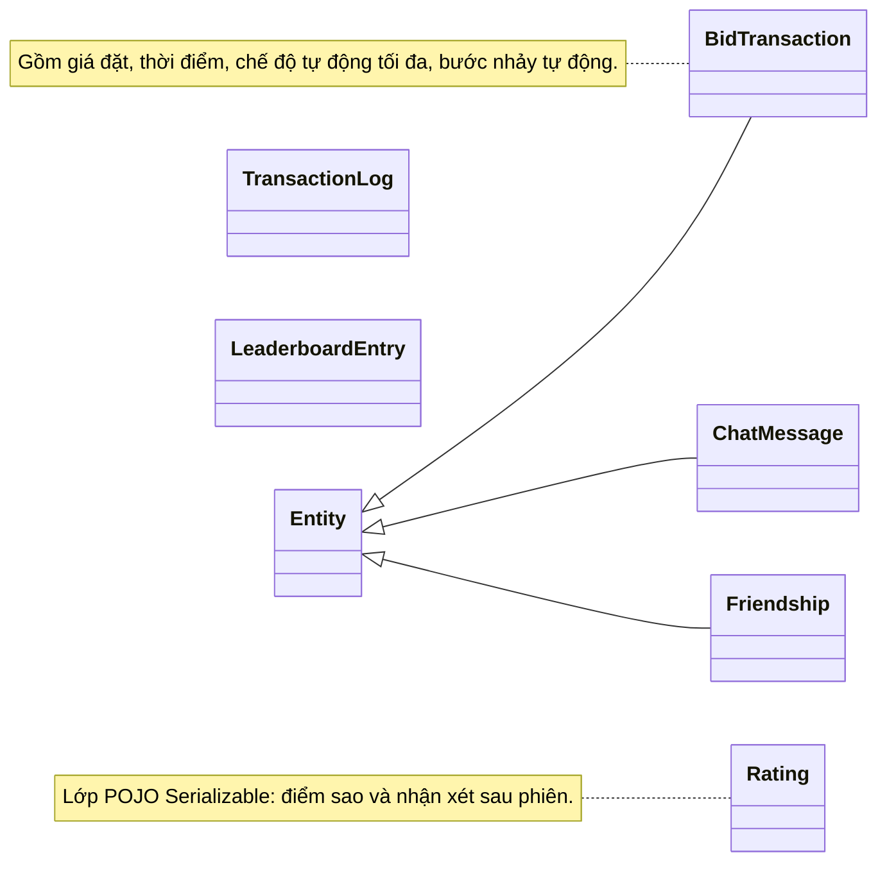
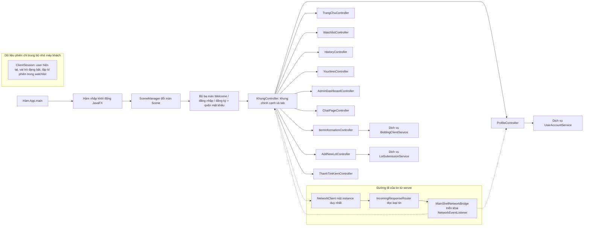
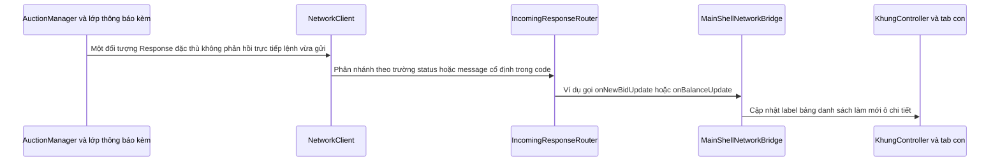

# Sơ đồ dự án (UML) — Hệ thống đấu giá

Tài liệu mô tả **kiến trúc thật trong mã nguồn**: ứng dụng JavaFX nói chuyện với server qua socket, hai bên dùng chung thư viện **`auction-shared`** (lớp `Request` / `Response` và các đối tượng dữ liệu).

**Cách đọc ký hiệu trong các bảng và sơ đồ lớp:**

- Dấu **`+`** là thành viên public, **`-`** là private, **`#`** là protected, **`~`** là thành viên ở phạm vi gói hoặc được dùng giống kiểu «nội bộ lớp cha» trong sơ đồ quen thuộc.

**Ví dụ nhanh một vòng gọi:** người dùng bấm «Đăng nhập» → màn hình gửi **`Request`** có `action = "LOGIN"` và `payload` chứa thông tin đăng nhập → server xử qua **`LoginHandler`** → trả **`Response`** trạng thái và (nếu thành công) **`User`** trong `payload`.

---

## 1. Ba module và cách nối nhau

**Quy ước gói tin trên dây (server lớp `ClientHandler`):**

1. Đọc bốn byte kiểu `int` = độ dài thân tin (tính bằng byte UTF-8).
2. Đọc đúng số byte đó → ghép thành một chuỗi JSON → Jackson đổi thành đối tượng **`Request`**.
3. Gửi ngược lại: chuỗi JSON của **`Response`** → ghi `int` độ dài → ghi byte.

**Hai cơ chế đi kèm mỗi kết nối:**

- **`TokenBucket`:** giới hạn số lần xử lý trong một khoảng thời gian (chống spam lệnh).
- **MDC log:** mỗi luồng xử lý gắn **`requestId`** để dò log theo từng yêu cầu.

---

## 2. Luồng xử lý phía server (nhìn từ trên xuống)

---

## 3. Phần dùng chung `com.auction.shared`

### 3.1 Người dùng và vai trò

**Vai trò cố định trong enum `UserRole`:** `BIDDER` (người đấu giá), `SELLER` (người bán), `ADMIN` (quản trị).

### 3.2 Mặt hàng, cơ chế đấu giá, trạng thái

**Trạng thái mặt hàng `ItemStatus`:** `PENDING` (chờ duyệt), `OPEN` (đang mở đấu), `CLOSED` (đóng kèm người thắng), `FINISHED` (hết giờ, chờ xử lý thanh toán), `EXPIRED` (hết giờ không có người thắng), `CANCELED` (huỷ). Chuỗi lưu trong MySQL được đổi lại enum bằng `parse`; chuỗi lạ vẫn quy về `OPEN` để không vỡ khi đọc dữ liệu cũ.

**Loại đấu giá `AuctionType`:** `ENGLISH` (giá tăng), `DUTCH` (giá giảm theo bước thời gian). Có hàm `parse` chuỗi và `dbName` để ghi đọc DB.

**Quan trọng:** trong gói shared **không có** lớp tên `Lot`. Danh sách phiên đấu trên giao diện vẫn là **`Item`**. Lớp **`LotDao`** trên server trả về **`Item`** hoặc **`List<Item>`**.

### 3.3 Đặt giá, chat, bạn bè; các bản ghi không kế thừa `Entity`

**Ba lớp tiện ích thường gọi cùng `Item`:**

- **`ItemFactory.createItem("Electronics")`** trả về instance phân loại tương ứng (ví dụ `Electronics`), mặc định không khớp thì là `Vehicle`.
- **`DutchAuctionPricing`:** các hàm tĩnh tính giá hiển thị và mốc đếm ngược cho đấu giá Dutch.
- **`PasswordEncoder`:** băm SHA-256 thành chuỗi hex — client và server dùng **cùng một hàm** `hash`; cột mật khẩu trong MySQL lưu hash, không lưu chuỗi mật khẩu nguyên bản.

### 3.4 Hai lớp vỏ bọc lệnh

- **`Request`:** hằng số kiểu chuỗi cho hành động (ví dụ `"LOGIN"`, `"BID"`, `"SEND_CHAT"`, `"GET_WATCHLIST"`, `"FORGOT_PASSWORD_REQ"`); thêm `requestId`, `action`, `payload`, `timestamp`.
- **`Response`:** ví dụ trạng thái **`SUCCESS`** / **`ERROR`**, các mã **`ACCOUNT_BANNED`** / **`ACCOUNT_UNBANNED`**, cộng `requestId`, `status`, `message`, `payload`, `timestamp`.

---

## 4. Ánh xạ lệnh trên server: `ActionRegistry` và các `Handler`

Contract cố định: **`Response ActionHandler.handle(Request request, HandlerContext context)`**.

Hai bọc chuẩn trong **`ActionHandler`:**

- **`requireAuth(inner)`:** nếu `context.getCurrentUser() == null` thì trả lỗi `"not_logged_in"`, không gọi `inner`.
- **`requireAdmin(inner)`:** nếu không phải `UserRole.ADMIN` thì trả `"forbidden"`, không gọi `inner`.

Bảng dưới là **ánh xạ theo chức năng**. Danh sách đầy đủ được **đăng ký trong mã `ClientHandler.buildRegistry()`** — một dòng một lệnh, ví dụ `reg.register(Request.BID, ActionHandler.requireAuth(new BidHandler()));`.

| Nhóm chức năng | Các handler được gọi trong mã hiện tại |
|----------------|----------------------------------------|
| Đăng nhập / đăng ký / kết nối lại | `LoginHandler`, `SignupHandler`, `ReconnectHandler` |
| Quên mật khẩu (OTP qua mail) | `ForgotPasswordHandler` |
| Danh sách, tìm kiếm, tự động ghép từ khóa Autocomplete |
| Đặt giá và quản lý listing người bán | `BidHandler`, `AddLotHandler`, `SellerCancelItemHandler`, `SellerUpdatePendingItemHandler` |
| Đánh giá | `RatingHandler` |
| Hồ sơ, ví, nạp tiền | `UpdateProfileHandler`, `UpdateAvatarHandler`, `DepositHandler` |
| Quản trị | `UserManagementHandler`; các lệnh duyệt/từ chối sản phẩm chờ và thống kê được gọi trong cùng lớp `ItemQueryHandler` / `MiscHandler` như trong `buildRegistry()` |
| Dịch vụ lặt vặt có session | `MiscHandler`: làm mới user, lịch sử giao dịch, lịch sử giá, ping, chart thống kê |
| Chat, bạn, bảng xếp hạng | `ChatHandler`, `FriendHandler`, `LeaderboardHandler` |
| Danh sách theo dõi | `WatchlistHandler` |

**Hai singleton nằm trọng tâm realtime và kết phiên:**

- **`AuctionManager`:** ví dụ **`processBid`**, **`sendToUser`** / **`broadcast`**, giữ phiên đăng nhập theo token, **`LeaderboardService`** nội bộ.
- **`SettlementService`:** xếp hàng sự kiện kết thúc phiên và xử lý thanh quyết.

---

## 5. Lớp truy xuất dữ liệu (DAO) — nhiệm vụ chính

| DAO | Nhiệm vụ được thấy trong mã |
|-----|------------------------------|
| **UserDao** | Đăng nhập đăng ký, đọc theo id/tên/khoá tìm kiếm, cập nhật hồ sơ và avatar, cộng trừ số dư có biến thể transactional, khóa mở tài khoản, đổi vai trò, đặt lại mật khẩu theo email |
| **ItemDao** | Đọc toàn cục / theo người bán / chờ duyệt, insert lot, đóng phiên **`atomicCloseAuction`**, duyệt từ chối, thống kê, các thao tác huỷ / cập nhật trong giao dịch SQL |
| **BidDao** | Lịch sử đặt theo phiên, ghi nhận bid trong transaction, tìm người đứng giá cao trước đó, dọn bid khi cấm huỷ |
| **LotDao** | Các nhóm phiên đang diễn ra / sắp diễn ra / đã đóng / đã qua / trending và **danh sách item trong watchlist** |
| **RatingDao** | Thêm đánh giá, kiểm tra đã đánh giá chưa, đọc theo phiên, tính lại điểm trung bình người được đánh giá |
| **TransactionLogDao** | Ghi log giao dịch ví và đọc theo user |
| **ChatDao** | Gửi tin, lấy lịch sử kênh toàn cục / riêng tư, danh sách đối tác đã chat |
| **FriendDao** | Gửi lời mời, đồng ý từ chối, xoá bạn, đọc danh sách và trạng thái hai người |
| **WatchlistDao** | Đọc danh sách id phiên theo dõi và ghi bật tắt theo dõi |

**Lớp nền không phụ thuộc nghiệp vụ:**

- **`DatabaseConnection`:** một instance toàn cục, Hikari tạo kết nối; **`closePool`** gọi khi server tắt.
- **`DatabaseMigration.runAll()`** và các lớp `*Migration` trong package platform tạo / sửa cột bảng trước khi nhận kết nối người dùng.

---

## 6. Máy khách JavaFX `com.auction.client`

**Giao diện `NetworkEventListener`** (mỗi callback có thân mặc định rỗng trong interface): máy chủ chủ động đẩy tin — ví dụ cập nhật số dư **`onBalanceUpdate`**, có giá mới **`onNewBidUpdate`**, bị trả giá **`onOutbidNotify`**, phiên kết thúc **`onItemClosed`**, chat **`onGlobalChat` / `onPrivateChat`**, sự kiện bạn bè **`onFriendRequest`**, **`onFriendAccepted`**, bảng xếp hạng **`onLeaderboardUpdate`**, **`onAccountBanned` / `onAccountUnbanned`**, người bán được báo **`onSellerBidNotify`**.

**Lớp kết nối:** **`NetworkClient.getInstance()`**, **`sendRequestAndWait`** gửi một **`Request`** và chờ **`Response`**; **`addListener` / `removeListener`** ghép các thành phần UI; **`uploadFile`** tĩnh dùng khi đăng ảnh phiên đấu.

**Chuyển cảnh nội bộ Pane:** **`NodeManager`** và **`NodeContentLoader<T>`** (`load(path fxml)`, lấy `Node` và controller).

Mỗi màn hình JavaFX khớp một cặp: file **`.fxml`** trong `src/main/resources` và lớp **`*Controller.java`** trong package `com.auction.client`; tên biến `@FXML` chỉ xuất hiện trong hai file đó.

---

## 7. Chuỗi realtime: máy chủ → máy khách → màn hình

**Ví dụ cụ thể:** có giá mới → server gửi payload chứa **`Item`** đã cập nhật → router gọi **`onNewBidUpdate`** → `KhungController` / `ItemInformationController` đọc **`Item`** và vẽ lại giá trên UI.

---

## 8. Cách khớp tài liệu này với mã nguồn

- Luồng đăng ký handler và tên **`Request.*`** cố định nằm trong **`auction-server/src/.../ClientHandler.java`**, nhánh **`buildRegistry()`**.
- Luồng đọc và phân nhánh realtime nằm trong **`auction-client/src/.../network/`** (**`NetworkClient`**, **`IncomingResponseRouter`**, **`MainShellNetworkBridge`**).
- Mọi lớp public trong **`auction-shared/src/main/java/com/auction/shared/`** là nguồn chân lý cho mục 3.

---

*Tài liệu mô tả đúng cấu trúc thư mục `com.auction.*` tại thời điểm viết file Summary này.*
