# Sơ đồ UML — Hệ thống đấu giá (auction-client / auction-server / auction-shared)

Tài liệu mô tả **kiến trúc thật trong mã nguồn**: ứng dụng JavaFX nói chuyện với server qua socket TCP, hai bên dùng chung thư viện **`auction-shared`**.

> **Cách đọc:** Diagram **tách theo chủ đề** để tránh chồng chéo; nội dung **đầy đủ** nằm ở diagram + **bảng** bên dưới mỗi mục.

**Mục lục**

1. [Ba module — tổng quan](#1-ba-module--tổng-quan)
2. [auction-shared (23 lớp)](#2-auction-shared-23-lớp)
3. [auction-server (72 lớp)](#3-auction-server-72-lớp)
4. [auction-client (72 lớp)](#4-auction-client-72-lớp)
5. [Luồng xuyên module](#5-luồng-xuyên-module)
6. [Realtime server → client](#6-realtime-server--client)
7. [Ma trận phụ thuộc & tham chiếu](#7-ma-trận-phụ-thuộc--tham-chiếu)

**Ký hiệu UML:** `+` public · `-` private · `#` protected · `<<interface>>` · `<<singleton>>` · `<<utility>>` · `<<enumeration>>`

---

## 1. Ba module — tổng quan

### 1.1 Phụ thuộc Maven & runtime

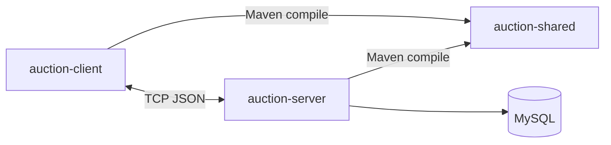
```mermaid
flowchart LR
  C[auction-client]
  S[auction-shared]
  V[auction-server]
  DB[(MySQL)]

  C -->|Maven compile| S
  V -->|Maven compile| S
  C <-->|TCP JSON| V
  V --> DB
```

| Liên kết | Loại | Ý nghĩa |
|----------|------|---------|
| **Client → Shared** | Compile-time | Import `Request`, `Response`, `User`, `Item`, … |
| **Server → Shared** | Compile-time | Handler trả `Response` chứa shared POJO |
| **Client ⇄ Server** | Runtime | Một socket TCP; Jackson serialize/deserialize |
| **Server → MySQL** | Runtime | HikariCP; client **không** có JDBC |

### 1.2 Nội bộ từng module

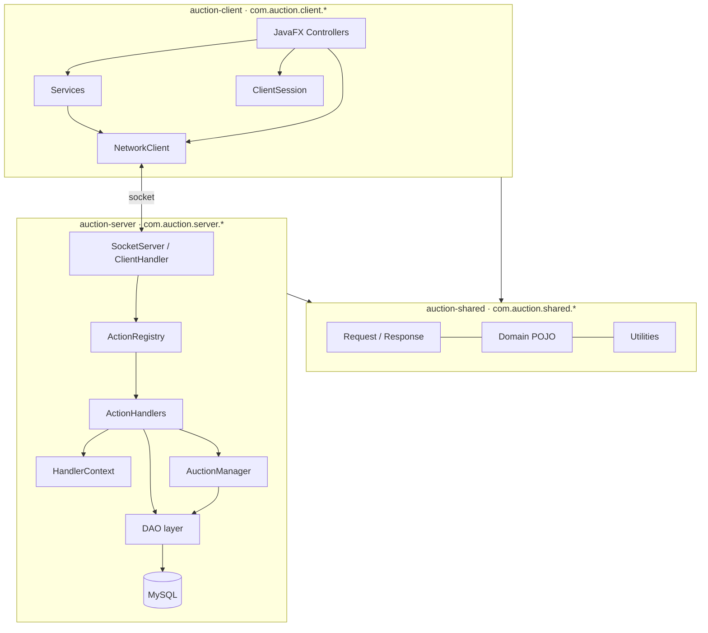
```mermaid
flowchart TB
  subgraph CL["auction-client · com.auction.client.*"]
    direction LR
    UI[JavaFX Controllers] --> SVC[Services]
    SVC --> NET[NetworkClient]
    UI --> SESS[ClientSession]
    UI --> NET
  end

  subgraph SH["auction-shared · com.auction.shared.*"]
    direction LR
    WR[Request / Response] --- DOM[Domain POJO] --- UT[Utilities]
  end

  subgraph SV["auction-server · com.auction.server.*"]
    direction TB
    SOCK[SocketServer / ClientHandler] --> REG[ActionRegistry]
    REG --> HND[ActionHandlers]
    HND --> CTX[HandlerContext]
    HND --> AM[AuctionManager]
    HND --> DAO[DAO layer]
    AM --> DAO --> DB[(MySQL)]
  end

  CL --> SH
  SV --> SH
  NET <-->|socket| SOCK
```

### 1.3 Gói tin & bảo vệ kết nối

**Quy ước (`ClientHandler`):**

1. Đọc 4 byte `int` = độ dài thân (byte UTF-8).
2. Đọc đúng số byte → chuỗi JSON → `Request`.
3. Gửi ngược: JSON `Response` → ghi `int` độ dài → ghi byte.

**Mỗi socket:**

- **`TokenBucket`:** giới hạn tốc độ xử lý (chống spam).
- **MDC log:** gắn `requestId` vào luồng để truy vết log.

**Jackson:** cả client và server dùng `activateDefaultTyping` để serialize polymorphic (`Electronics`, `User`, …).

---

## 2. auction-shared (23 lớp)

Package: `com.auction.shared` — không phụ thuộc client/server.

**Danh sách đầy đủ:** `Entity`, `User`, `Admin`, `Seller`, `Bidder`, `Item`, `Art`, `Electronics`, `Vehicle`, `BidTransaction`, `ChatMessage`, `Friendship`, `Rating`, `TransactionLog`, `LeaderboardEntry`, `UserRole`, `ItemStatus`, `AuctionType`, `Request`, `Response`, `ItemFactory`, `DutchAuctionPricing`, `PasswordEncoder`.

### 2.1 Entity gốc

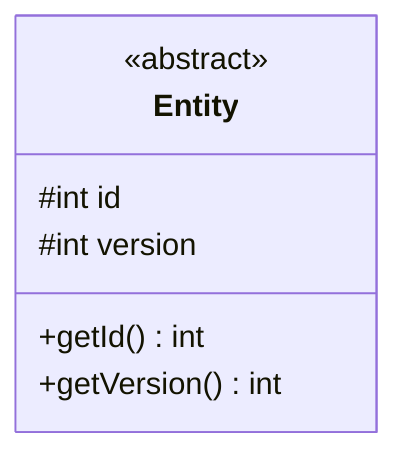
```mermaid
classDiagram
direction TB
class Entity {
  <<abstract>>
  #int id
  #int version
  +getId() int
  +getVersion() int
}
```

Optimistic locking: `version` dùng khi `ItemDao.updatePriceTx`.

### 2.2 User — phân cấp & trường

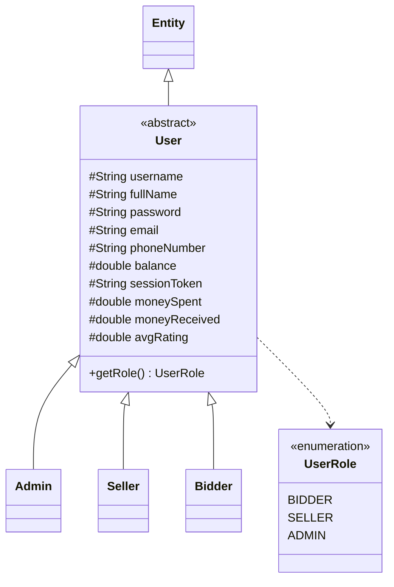
```mermaid
classDiagram
direction TB
class Entity
class User {
  <<abstract>>
  #String username
  #String fullName
  #String password
  #String email
  #String phoneNumber
  #double balance
  #String sessionToken
  #double moneySpent
  #double moneyReceived
  #double avgRating
  +getRole() UserRole
}
class Admin
class Seller
class Bidder
class UserRole {
  <<enumeration>>
  BIDDER
  SELLER
  ADMIN
}
Entity <|-- User
User <|-- Admin
User <|-- Seller
User <|-- Bidder
User ..> UserRole
```

### 2.3 Item — phân cấp & trường

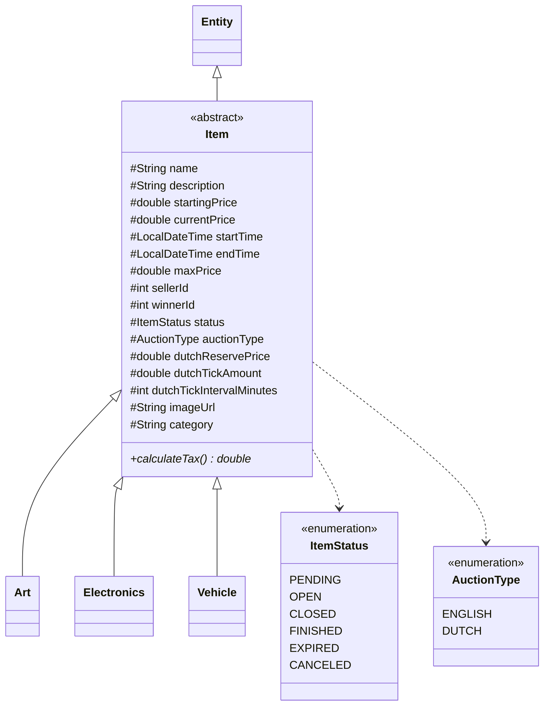
```mermaid
classDiagram
direction TB
class Entity
class Item {
  <<abstract>>
  #String name
  #String description
  #double startingPrice
  #double currentPrice
  #LocalDateTime startTime
  #LocalDateTime endTime
  #double maxPrice
  #int sellerId
  #int winnerId
  #ItemStatus status
  #AuctionType auctionType
  #double dutchReservePrice
  #double dutchTickAmount
  #int dutchTickIntervalMinutes
  #String imageUrl
  #String category
  +calculateTax()* double
}
class Art
class Electronics
class Vehicle
class ItemStatus {
  <<enumeration>>
  PENDING
  OPEN
  CLOSED
  FINISHED
  EXPIRED
  CANCELED
}
class AuctionType {
  <<enumeration>>
  ENGLISH
  DUTCH
}
Entity <|-- Item
Item <|-- Art
Item <|-- Electronics
Item <|-- Vehicle
Item ..> ItemStatus
Item ..> AuctionType
```

| `ItemStatus` | Ý nghĩa trong luồng thực tế |
|--------------|----------------------------|
| `PENDING` | Chờ admin duyệt |
| `OPEN` | Đang hoặc sắp mở đấu |
| `CLOSED` | Kết thúc có người thắng |
| `FINISHED` | Enum có sẵn; settlement chủ yếu dùng `CLOSED`/`EXPIRED` |
| `EXPIRED` | Hết giờ, không ai bid |
| `CANCELED` | Seller/admin hủy |

> **Không có lớp `Lot`.** Catalog, history, watchlist đều là **`Item`**. `LotDao` (server) trả `List<Item>`.

### 2.4 Bid, Chat, Rating & POJO khác

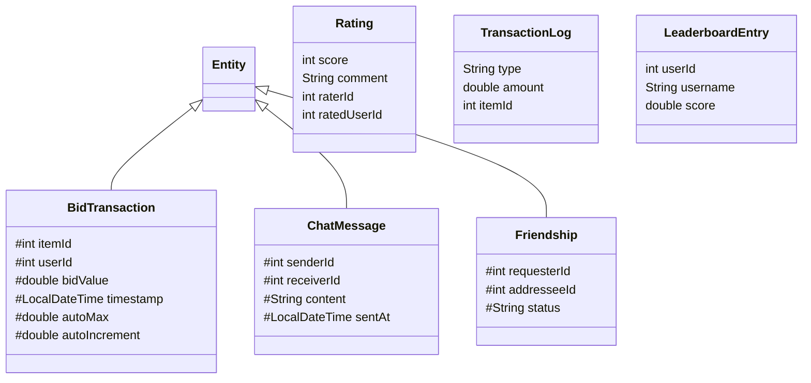
```mermaid
classDiagram
direction TB
class Entity
class BidTransaction {
  #int itemId
  #int userId
  #double bidValue
  #LocalDateTime timestamp
  #double autoMax
  #double autoIncrement
}
class ChatMessage {
  #int senderId
  #int receiverId
  #String content
  #LocalDateTime sentAt
}
class Friendship {
  #int requesterId
  #int addresseeId
  #String status
}
class Rating {
  int score
  String comment
  int raterId
  int ratedUserId
}
class TransactionLog {
  String type
  double amount
  int itemId
}
class LeaderboardEntry {
  int userId
  String username
  double score
}
Entity <|-- BidTransaction
Entity <|-- ChatMessage
Entity <|-- Friendship
```

### 2.5 Request & Response

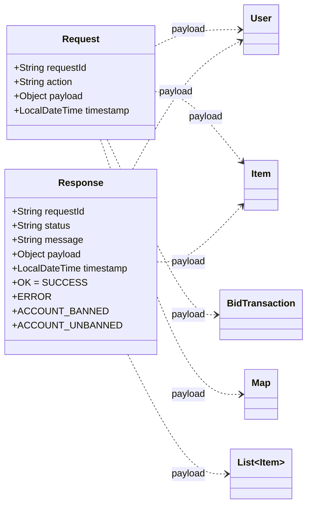
```mermaid
classDiagram
direction LR
class Request {
  +String requestId
  +String action
  +Object payload
  +LocalDateTime timestamp
}
class Response {
  +String requestId
  +String status
  +String message
  +Object payload
  +LocalDateTime timestamp
  +OK = SUCCESS
  +ERROR
  +ACCOUNT_BANNED
  +ACCOUNT_UNBANNED
}
Request ..> User : payload
Request ..> Item : payload
Request ..> BidTransaction : payload
Request ..> Map : payload
Response ..> User : payload
Response ..> Item : payload
Response ..> List~Item~ : payload
```

**Hằng số `Request` (đầy đủ theo mã):**

| Nhóm | Constants |
|------|-----------|
| Auth | `LOGIN`, `LOGOUT`, `SIGNUP`, `RECONNECT`, `FORGOT_PASSWORD_REQ`, `FORGOT_PASSWORD_RESET` |
| Auction | `BID`, `ADD_LOT`, `ADD`, `LIST`, `GET_ONGOING_LOTS`, `GET_ONGOING_BIDS`, `GET_TRENDING_LOTS`, `GET_UPCOMING_BIDS`, `GET_CLOSED_BIDS`, `GET_PAST_BIDS`, `GET_WATCHLIST_ITEMS`, `AUTOCOMPLETE` |
| Item seller | `SELLER_CANCEL_ITEM`, `SELLER_UPDATE_PENDING_ITEM`, `GET_MY_ITEMS`, `GET_ITEM_BY_ID` |
| Admin item | `GET_PENDING_ITEMS`, `APPROVE_ITEM`, `REJECT_ITEM` |
| User | `UPDATE_PROFILE`, `UPDATE_AVATAR`, `DEPOSIT`, `REFRESH_USER`, `GET_ALL_USERS`, `SEARCH_USERS`, `GET_USER_BY_ID`, `LOCK_USER`, `UNLOCK_USER`, `PROMOTE_ADMIN` |
| Watchlist | `GET_WATCHLIST`, `TOGGLE_WATCHLIST` |
| Rating | `SUBMIT_RATING`, `GET_RATINGS` |
| Wallet/history | `GET_TRANSACTIONS`, `GET_BID_HISTORY` |
| Chat/friend | `SEND_CHAT`, `GET_GLOBAL_CHAT_HISTORY`, `GET_PRIVATE_CHAT_HISTORY`, `GET_CHAT_CONTACTS`, `ADD_FRIEND`, `ACCEPT_FRIEND`, `DECLINE_FRIEND`, `REMOVE_FRIEND`, `GET_FRIENDS`, `GET_FRIEND_REQUESTS` |
| Misc | `PING`, `GET_LEADERBOARD`, `GET_STATUS_STATS`, `GET_CATEGORY_STATS` |

### 2.6 Tiện ích dùng chung

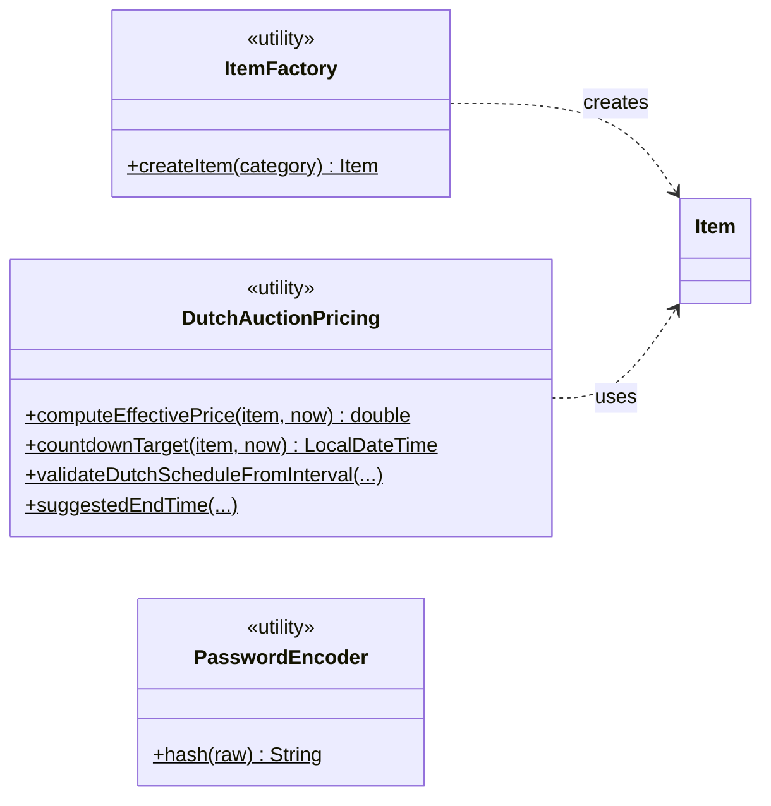
```mermaid
classDiagram
direction LR
class ItemFactory {
  <<utility>>
  +createItem(category)$ Item
}
class DutchAuctionPricing {
  <<utility>>
  +computeEffectivePrice(item, now)$ double
  +countdownTarget(item, now)$ LocalDateTime
  +validateDutchScheduleFromInterval(...)$
  +suggestedEndTime(...)$
}
class PasswordEncoder {
  <<utility>>
  +hash(raw)$ String
}
ItemFactory ..> Item : creates
DutchAuctionPricing ..> Item : uses
```

- **`ItemFactory`:** `"Electronics"` → `Electronics`, mặc định → `Vehicle`.
- **`PasswordEncoder`:** SHA-256 hex — client hash trước khi gửi `LOGIN`/`SIGNUP`.
- **`DutchAuctionPricing`:** dùng cả client (preview UI) và server (`DutchAuctionCatalogSync`).

---

## 3. auction-server (72 lớp)

Package gốc: `com.auction.server`.

**Cấu trúc package:**

| Package | Vai trò |
|---------|---------|
| `controller` | `Main`, `SocketServer`, `ClientHandler`, `TokenBucket` |
| `handler.auth` | Login, Signup, Logout, Reconnect, ForgotPassword |
| `handler.auction` | Bid, AddLot, Seller*, LotQuery, ItemQuery, List, Autocomplete |
| `handler.user` | Profile, Avatar, Deposit, Watchlist, UserManagement |
| `handler.chat` | Chat, Friend |
| `handler.rating` | Rating |
| `handler.misc` | Leaderboard, Misc (ping, stats, …) |
| `handler.dispatch` | `ActionHandler`, `ActionRegistry`, `HandlerContext` |
| `service.auction` | AuctionManager, BidPipeline, Settlement, AutoBid, … |
| `service.user` | UserService |
| `dao.*` | ItemDao, LotDao, BidDao, UserDao, … |
| `dao.platform` | DatabaseConnection, Migration, BaseDao |

### 3.1 Khởi động server

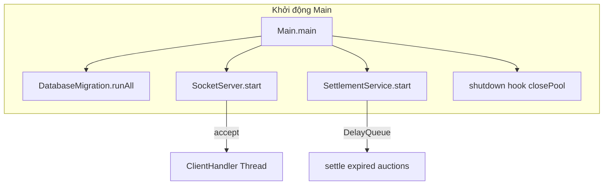
```mermaid
flowchart TB
  subgraph boot["Khởi động Main"]
    M[Main.main]
    M --> DM[DatabaseMigration.runAll]
    M --> SS[SocketServer.start]
    M --> ST[SettlementService.start]
    M --> HOOK[shutdown hook closePool]
  end
  SS -->|accept| CH[ClientHandler Thread]
  ST -->|DelayQueue| SET[settle expired auctions]
```

### 3.2 Luồng xử lý một Request

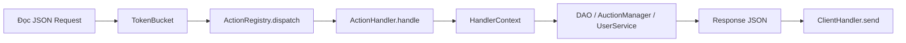
```mermaid
flowchart LR
  A[Đọc JSON Request] --> B[TokenBucket]
  B --> C[ActionRegistry.dispatch]
  C --> D[ActionHandler.handle]
  D --> E[HandlerContext]
  E --> F[DAO / AuctionManager / UserService]
  F --> G[Response JSON]
  G --> H[ClientHandler.send]
```

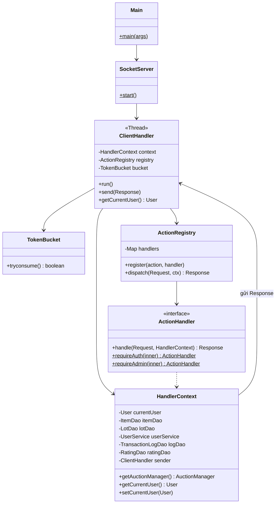
```mermaid
classDiagram
direction TB
class Main {
  +main(args)$
}
class SocketServer {
  +start()$
}
class ClientHandler {
  <<Thread>>
  -HandlerContext context
  -ActionRegistry registry
  -TokenBucket bucket
  +run()
  +send(Response)
  +getCurrentUser() User
}
class TokenBucket {
  +tryconsume() boolean
}
class ActionRegistry {
  -Map handlers
  +register(action, handler)
  +dispatch(Request, ctx) Response
}
class ActionHandler {
  <<interface>>
  +handle(Request, HandlerContext) Response
  +requireAuth(inner)$ ActionHandler
  +requireAdmin(inner)$ ActionHandler
}
class HandlerContext {
  -User currentUser
  -ItemDao itemDao
  -LotDao lotDao
  -UserService userService
  -TransactionLogDao logDao
  -RatingDao ratingDao
  -ClientHandler sender
  +getAuctionManager() AuctionManager
  +getCurrentUser() User
  +setCurrentUser(User)
}
Main --> SocketServer
SocketServer --> ClientHandler
ClientHandler --> ActionRegistry
ClientHandler --> HandlerContext
ClientHandler --> TokenBucket
ActionRegistry --> ActionHandler
ActionHandler ..> HandlerContext
HandlerContext --> ClientHandler : gửi Response
```

### 3.3 Handlers — từng nhóm (implements ActionHandler)

**Nhóm Auth**

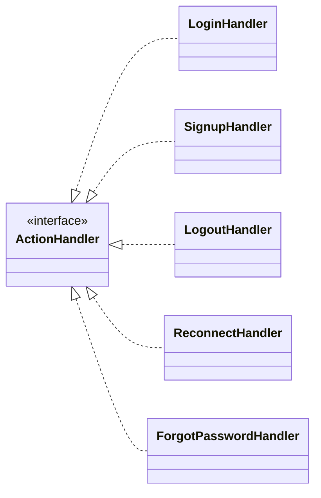
```mermaid
classDiagram
direction LR
class ActionHandler {
  <<interface>>
}
class LoginHandler
class SignupHandler
class LogoutHandler
class ReconnectHandler
class ForgotPasswordHandler
ActionHandler <|.. LoginHandler
ActionHandler <|.. SignupHandler
ActionHandler <|.. LogoutHandler
ActionHandler <|.. ReconnectHandler
ActionHandler <|.. ForgotPasswordHandler
```

**Nhóm Auction**

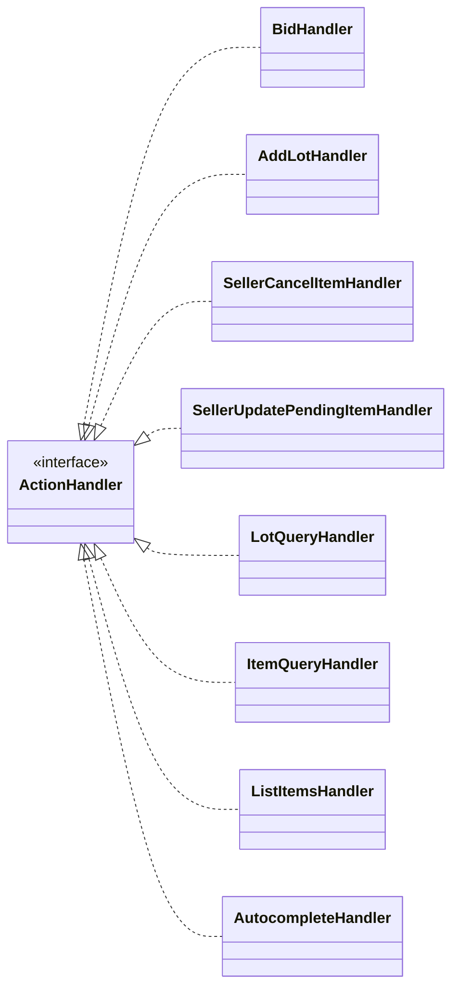
```mermaid
classDiagram
direction LR
class ActionHandler {
  <<interface>>
}
class BidHandler
class AddLotHandler
class SellerCancelItemHandler
class SellerUpdatePendingItemHandler
class LotQueryHandler
class ItemQueryHandler
class ListItemsHandler
class AutocompleteHandler
ActionHandler <|.. BidHandler
ActionHandler <|.. AddLotHandler
ActionHandler <|.. SellerCancelItemHandler
ActionHandler <|.. SellerUpdatePendingItemHandler
ActionHandler <|.. LotQueryHandler
ActionHandler <|.. ItemQueryHandler
ActionHandler <|.. ListItemsHandler
ActionHandler <|.. AutocompleteHandler
```

**Nhóm User**

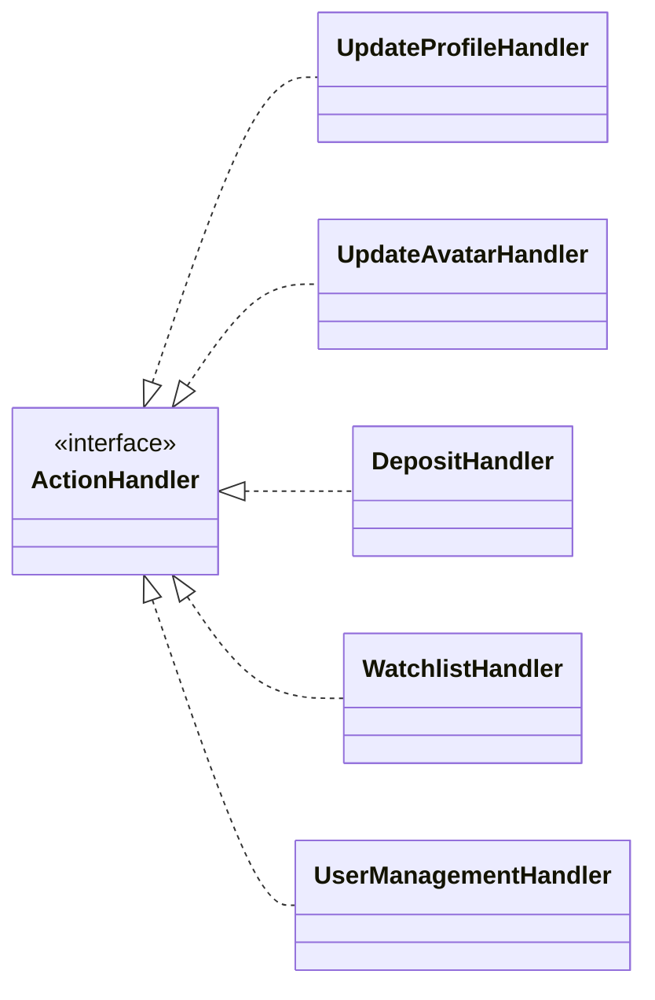
```mermaid
classDiagram
direction LR
class ActionHandler {
  <<interface>>
}
class UpdateProfileHandler
class UpdateAvatarHandler
class DepositHandler
class WatchlistHandler
class UserManagementHandler
ActionHandler <|.. UpdateProfileHandler
ActionHandler <|.. UpdateAvatarHandler
ActionHandler <|.. DepositHandler
ActionHandler <|.. WatchlistHandler
ActionHandler <|.. UserManagementHandler
```

**Nhóm Social & Misc**

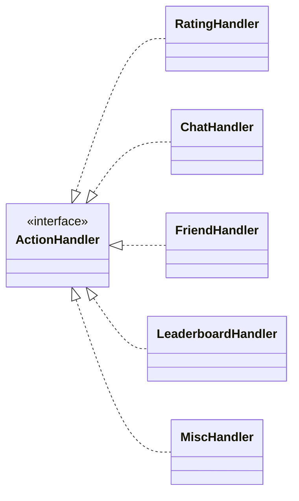
```mermaid
classDiagram
direction LR
class ActionHandler {
  <<interface>>
}
class RatingHandler
class ChatHandler
class FriendHandler
class LeaderboardHandler
class MiscHandler
ActionHandler <|.. RatingHandler
ActionHandler <|.. ChatHandler
ActionHandler <|.. FriendHandler
ActionHandler <|.. LeaderboardHandler
ActionHandler <|.. MiscHandler
```

| Nhóm | Handler | Auth |
|------|---------|------|
| Auth | Login, Signup, Logout, Reconnect, ForgotPassword | Public / session |
| Auction | Bid, AddLot, SellerCancel, SellerUpdate, LotQuery, ItemQuery, List, Autocomplete | Bid/Add/Seller*: `requireAuth` |
| User | UpdateProfile, UpdateAvatar, Deposit, Watchlist, UserManagement | Auth; ban: Admin |
| Social | Rating, Chat, Friend, Leaderboard, Misc | Tùy action |
| Admin | Approve/Reject item, Lock/Unlock/Promote user, Stats | `requireAdmin` |

### 3.4 Ánh xạ Request → Handler (`buildRegistry`)

| Request constant | Handler | Wrapper |
|------------------|---------|---------|
| `LOGIN`, `SIGNUP`, `RECONNECT` | Login/Signup/ReconnectHandler | — |
| `LOGOUT` | LogoutHandler | — |
| `BID` | BidHandler | requireAuth |
| `ADD_LOT` | AddLotHandler | requireAuth |
| `SELLER_CANCEL_ITEM` | SellerCancelItemHandler | requireAuth |
| `SELLER_UPDATE_PENDING_ITEM` | SellerUpdatePendingItemHandler | requireAuth |
| `GET_ONGOING_BIDS`, `GET_TRENDING_LOTS`, `GET_UPCOMING_BIDS`, `GET_CLOSED_BIDS`, `GET_PAST_BIDS`, `GET_WATCHLIST_ITEMS` | LotQueryHandler | — |
| `GET_MY_ITEMS`, `GET_ITEM_BY_ID`, `GET_PENDING_ITEMS`, `APPROVE_ITEM`, `REJECT_ITEM` | ItemQueryHandler | Admin cho pending/approve/reject |
| `LIST`, `GET_ONGOING_LOTS` | ListItemsHandler | — |
| `AUTOCOMPLETE` | AutocompleteHandler | — |
| `GET_WATCHLIST`, `TOGGLE_WATCHLIST` | WatchlistHandler | requireAuth |
| `UPDATE_PROFILE`, `UPDATE_AVATAR`, `DEPOSIT` | Profile/Avatar/DepositHandler | requireAuth |
| `SUBMIT_RATING`, `GET_RATINGS` | RatingHandler | submit: requireAuth |
| `SEND_CHAT`, chat history, contacts | ChatHandler | send: requireAuth |
| `ADD/ACCEPT/DECLINE/REMOVE_FRIEND`, `GET_FRIENDS`, `GET_FRIEND_REQUESTS` | FriendHandler | mutate: requireAuth |
| `GET_ALL_USERS`, `SEARCH_USERS`, `GET_USER_BY_ID`, `LOCK_USER`, `UNLOCK_USER`, `PROMOTE_ADMIN` | UserManagementHandler | lock/promote: requireAdmin |
| `REFRESH_USER`, `GET_TRANSACTIONS`, `GET_BID_HISTORY`, `PING`, stats | MiscHandler | stats: requireAdmin |
| `GET_LEADERBOARD` | LeaderboardHandler | — |
| `FORGOT_PASSWORD_*` | ForgotPasswordHandler | — |

Nguồn: `auction-server/.../ClientHandler.java` → `buildRegistry()`.

### 3.5 AuctionManager — lõi realtime

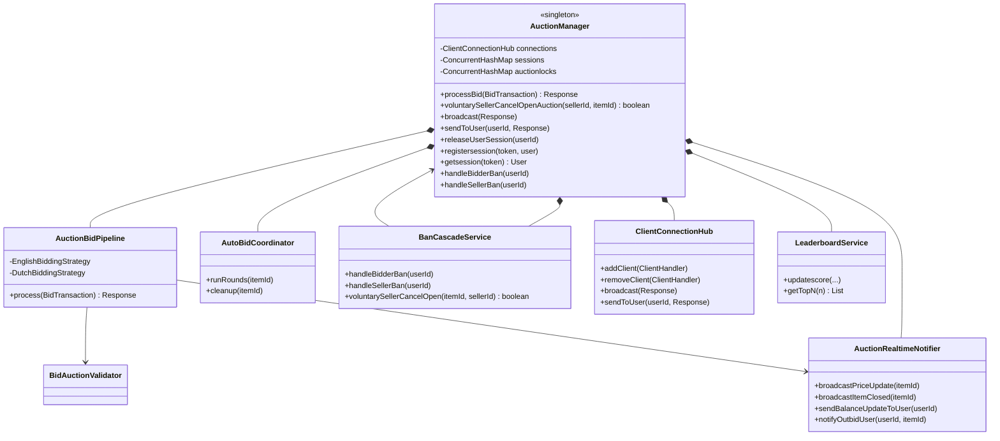
```mermaid
classDiagram
direction TB
class AuctionManager {
  <<singleton>>
  -ClientConnectionHub connections
  -ConcurrentHashMap sessions
  -ConcurrentHashMap auctionlocks
  +processBid(BidTransaction) Response
  +voluntarySellerCancelOpenAuction(sellerId, itemId) boolean
  +broadcast(Response)
  +sendToUser(userId, Response)
  +releaseUserSession(userId)
  +registersession(token, user)
  +getsession(token) User
  +handleBidderBan(userId)
  +handleSellerBan(userId)
}
class AuctionBidPipeline {
  +process(BidTransaction) Response
  -EnglishBiddingStrategy
  -DutchBiddingStrategy
}
class AutoBidCoordinator {
  +runRounds(itemId)
  +cleanup(itemId)
}
class BanCascadeService {
  +handleBidderBan(userId)
  +handleSellerBan(userId)
  +voluntarySellerCancelOpen(itemId, sellerId) boolean
}
class AuctionRealtimeNotifier {
  +broadcastPriceUpdate(itemId)
  +broadcastItemClosed(itemId)
  +sendBalanceUpdateToUser(userId)
  +notifyOutbidUser(userId, itemId)
}
class ClientConnectionHub {
  +addClient(ClientHandler)
  +removeClient(ClientHandler)
  +broadcast(Response)
  +sendToUser(userId, Response)
}
class LeaderboardService {
  +updatescore(...)
  +getTopN(n) List
}
AuctionManager *-- AuctionBidPipeline
AuctionManager *-- AutoBidCoordinator
AuctionManager *-- BanCascadeService
AuctionManager *-- AuctionRealtimeNotifier
AuctionManager *-- ClientConnectionHub
AuctionManager *-- LeaderboardService
AuctionBidPipeline --> BidAuctionValidator
AuctionBidPipeline --> AuctionRealtimeNotifier
BanCascadeService --> AuctionManager
```

### 3.6 Dịch vụ phụ trợ đấu giá

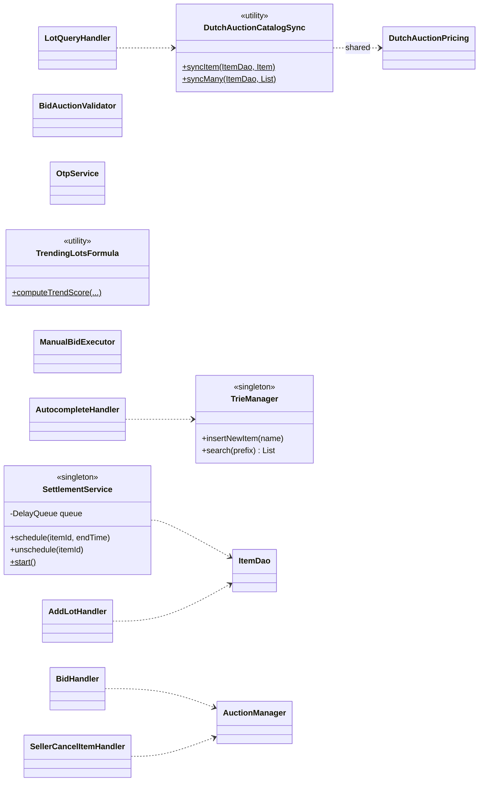
```mermaid
classDiagram
direction LR
class SettlementService {
  <<singleton>>
  -DelayQueue queue
  +schedule(itemId, endTime)
  +unschedule(itemId)
  +start()$
}
class DutchAuctionCatalogSync {
  <<utility>>
  +syncItem(ItemDao, Item)$
  +syncMany(ItemDao, List)$
}
class BidAuctionValidator
class TrieManager {
  <<singleton>>
  +insertNewItem(name)
  +search(prefix) List
}
class OtpService
class TrendingLotsFormula {
  <<utility>>
  +computeTrendScore(...)$
}
class ManualBidExecutor
SettlementService ..> ItemDao
DutchAuctionCatalogSync ..> DutchAuctionPricing : shared
LotQueryHandler ..> DutchAuctionCatalogSync
AutocompleteHandler ..> TrieManager
BidHandler ..> AuctionManager
SellerCancelItemHandler ..> AuctionManager
AddLotHandler ..> ItemDao
```

**Dutch lazy evaluation:** `DutchAuctionCatalogSync.syncItem` cập nhật giá khi query catalog / trước bid — không timer ghi DB mỗi phút.

**SettlementService:** khi `endTime` tới → `atomicCloseAuction` → `CLOSED` hoặc `EXPIRED` → broadcast `ITEM_CLOSED`.

### 3.7 Tầng DAO — interface & implementation

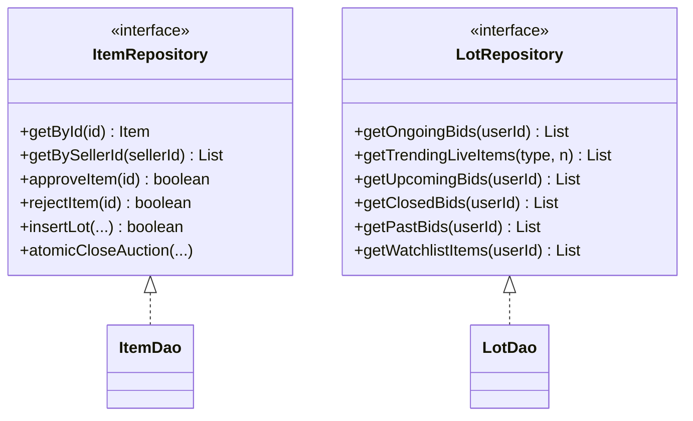
```mermaid
classDiagram
direction TB
class ItemRepository {
  <<interface>>
  +getById(id) Item
  +getBySellerId(sellerId) List
  +approveItem(id) boolean
  +rejectItem(id) boolean
  +insertLot(...) boolean
  +atomicCloseAuction(...)
}
class LotRepository {
  <<interface>>
  +getOngoingBids(userId) List
  +getTrendingLiveItems(type, n) List
  +getUpcomingBids(userId) List
  +getClosedBids(userId) List
  +getPastBids(userId) List
  +getWatchlistItems(userId) List
}
class ItemDao
class LotDao
ItemRepository <|.. ItemDao
LotRepository <|.. LotDao
```

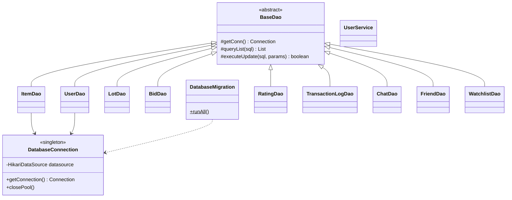
```mermaid
classDiagram
direction TB
class BaseDao {
  <<abstract>>
  #getConn() Connection
  #queryList(sql) List
  #executeUpdate(sql, params) boolean
}
class DatabaseConnection {
  <<singleton>>
  -HikariDataSource datasource
  +getConnection() Connection
  +closePool()
}
class DatabaseMigration {
  +runAll()$
}
class ItemDao
class LotDao
class BidDao
class UserDao
class RatingDao
class TransactionLogDao
class ChatDao
class FriendDao
class WatchlistDao
class UserService
BaseDao <|-- ItemDao
BaseDao <|-- LotDao
BaseDao <|-- BidDao
BaseDao <|-- UserDao
BaseDao <|-- RatingDao
BaseDao <|-- TransactionLogDao
BaseDao <|-- ChatDao
BaseDao <|-- FriendDao
BaseDao <|-- WatchlistDao
ItemDao --> DatabaseConnection
UserDao --> DatabaseConnection
DatabaseMigration ..> DatabaseConnection
```

| DAO | Nhiệm vụ chính |
|-----|----------------|
| **UserDao** | Login/signup, balance tx, profile, ban/unban, session token, `clearSessionToken` |
| **ItemDao** | CRUD lot, approve/reject, `atomicCloseAuction`, seller cancel/update, `updatePriceTx` |
| **BidDao** | placeBid tx, bid history, highest bidder, delete on ban |
| **LotDao** | Catalog queries + trending formula |
| **RatingDao** | Submit rating, recalc avg |
| **TransactionLogDao** | Wallet log (`BID_HOLD`, `BID_REFUND`, `ITEM_SOLD`, …) |
| **ChatDao** | Global/private history, contacts |
| **FriendDao** | Friend request lifecycle |
| **WatchlistDao** | Toggle / list ids |

**Ai gọi DAO:**

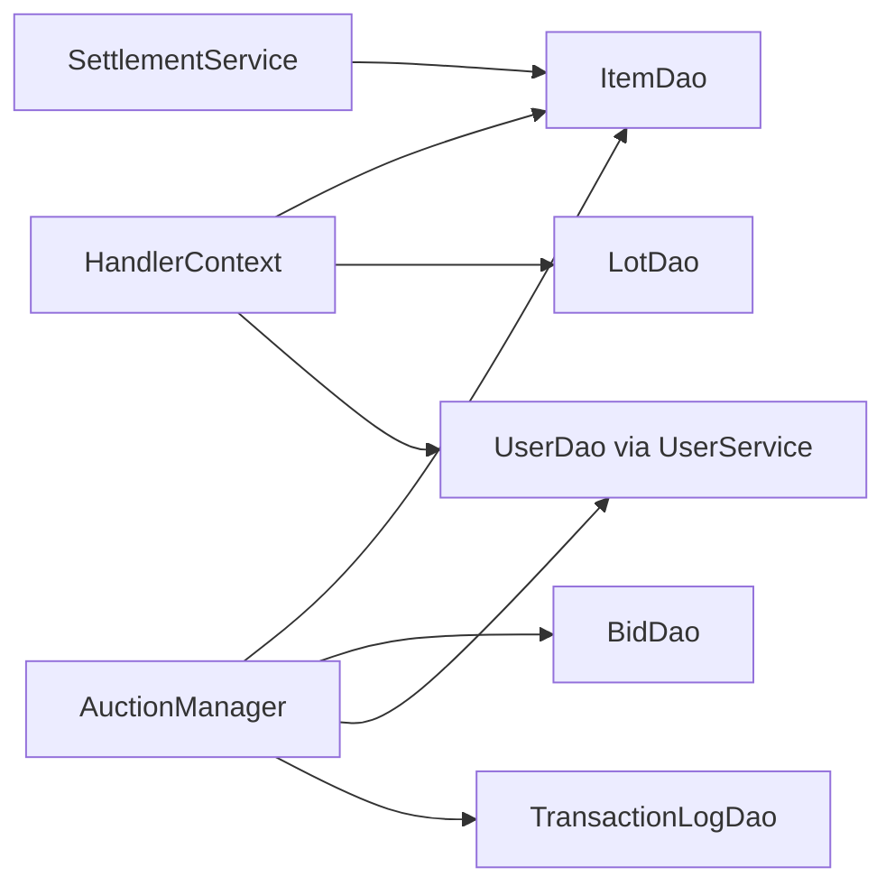
```mermaid
flowchart LR
  HC[HandlerContext] --> ID[ItemDao]
  HC --> LD[LotDao]
  HC --> UD[UserDao via UserService]
  AM[AuctionManager] --> ID
  AM --> BD[BidDao]
  AM --> UD
  AM --> TD[TransactionLogDao]
  SS[SettlementService] --> ID
```

**Map sang shared types:** `ItemDao.mapRow` → `Item`; `UserDao` → `User`; `BidDao` → `BidTransaction`.

---

## 4. auction-client (72 lớp)

Package gốc: `com.auction.client`.

**Cấu trúc package:**

| Package | Vai trò |
|---------|---------|
| `controller` | Welcome, Login, Register, ForgotPassword |
| `ui.Main` | KhungController, AdminDashboard, Navigator, NetworkBridge |
| `ui.TrangChu` | Home catalog, filter, carousel |
| `ui.History` | History + helpers |
| `ui.YourItem` | Seller listing |
| `ui.AddNewLot` | Form + Dutch schedule + submit |
| `ui.ItemInformation` | Detail, chart, autobid |
| `ui.ItemCard` | Card component |
| `ui.Profile`, `ui.UserProfile`, `ui.TransactionHistory` | User screens |
| `ui.Chat` | Chat page + bubbles |
| `ui.Watchlist`, `ui.BiddingForm`, `ui.RatingForm`, `ui.SearchBar` | Feature UI |
| `network` | NetworkClient, Router, Listener |
| `service` | UserAccount, Bidding, LotSubmission |
| `app` | NodeContentLoader, NodeManager |
| `util` | Image, Notification, Validators |

### 4.1 Khởi động app

```mermaid
flowchart LR
  App --> Main --> SM[SceneManager]
  SM --> W[welcome.fxml]
  SM --> L[login / register / forgot]
  SM --> K[Khung.fxml main shell]
```

### 4.2 Tầng mạng — class diagram đầy đủ

```mermaid
classDiagram
direction TB
class NetworkClient {
  <<singleton>>
  -ConcurrentHashMap pendingMap
  -List listeners
  -ObjectMapper jsonMapper
  +getInstance()$ NetworkClient
  +sendRequestAndWait(Request) Response
  +addListener(NetworkEventListener)
  +removeListener(NetworkEventListener)
  +uploadFile(url, bytes)$ String
  -attemptReconnect()
}
class IncomingResponseRouter {
  +dispatch(Response)
  -handleOutbid(payload)
  -handleLeaderboard(payload)
}
class NetworkEventListener {
  <<interface>>
  +onBalanceUpdate(User)
  +onNewBidUpdate(Item)
  +onItemClosed(Item)
  +onOutbidNotify(Item)
  +onSellerBidNotify(Item, price)
  +onGlobalChat(ChatMessage)
  +onPrivateChat(ChatMessage)
  +onFriendRequest(Friendship)
  +onFriendRequestSent(Friendship)
  +onFriendAccepted(Friendship)
  +onAccountBanned(String)
  +onAccountUnbanned()
  +onLeaderboardUpdate(List)
}
class MainShellNetworkBridge {
  +onNewBidUpdate(Item)
  +onItemClosed(Item)
  +onBalanceUpdate(User)
  +onAccountBanned(String)
}
class ObjectSocketConnection
class NetworkConnectionUi
NetworkClient --> IncomingResponseRouter
IncomingResponseRouter --> NetworkEventListener
MainShellNetworkBridge ..|> NetworkEventListener
NetworkClient o-- NetworkEventListener
```

| Push `Response.status` | Callback | UI cập nhật |
|--------------------------|----------|-------------|
| `BALANCE_UPDATE` | `onBalanceUpdate` | Profile, sidebar |
| `NEW_BID_UPDATE` | `onNewBidUpdate` | TrangChu, ItemInformation |
| `ITEM_CLOSED` | `onItemClosed` | TrangChu remove, ItemInfo, **YourItem** seller |
| `OUTBID_NOTIFY` | `onOutbidNotify` | NotificationCenter |
| `SELLER_BID_NOTIFY` | `onSellerBidNotify` | NotificationCenter |
| `CHAT_GLOBAL` / `CHAT_PRIVATE` | chat callbacks | ChatPageController |
| `FRIEND_REQUEST` | `onFriendRequest` | Chat + notification |
| `ACCOUNT_BANNED` | `onAccountBanned` | Alert → forced logout |
| `LEADERBOARD_UPDATE` | `onLeaderboardUpdate` | TrangChu leaderboard |

Request thường: `pendingMap` + `CompletableFuture` complete theo `requestId`. Timeout 30s.

### 4.3 KhungController — shell & tab

```mermaid
classDiagram
direction TB
class KhungController {
  -MainShellNavigator navigator
  -MainShellNetworkBridge networkBridge
  -AuctionSearchFilterState searchFilters
  -TrangChuController homeController
  -YourItemController myItemsController
  -HistoryController historyController
  -WatchlistController watchlistController
  -ProfileController profileController
  -AdminDashboardController adminController
  -ChatPageController chatController
  -ItemInformationController itemDetailController
  -AddNewLotController addLotController
  +handleSignout()
  +notifySellerListingClosed(Item)$
  +notifyWatchlistToggle(itemId, watched)$
  +openEditPendingItem(Item)$
  +returnFromLotEditor(saved)$
}
class MainShellNavigator {
  +switchPage(node, menuButton)
  +setCurrentContentNode(node)
}
class MainShellNetworkBridge
class ClientSession {
  <<static>>
  -User currentUser
  -UserRole activeRole
  -Set watchedItemIds
  +getCurrentUser() User
  +toggleRole()
  +clear()
  +isWatching(itemId) boolean
}
KhungController *-- MainShellNavigator
KhungController *-- MainShellNetworkBridge
KhungController --> NetworkClient
KhungController ..> ClientSession
MainShellNetworkBridge ..|> NetworkEventListener
```

**Tab sidebar (FXML `Khung.fxml`):**

```mermaid
flowchart LR
  KC[KhungController] --> TC[TrangChuController]
  KC --> WL[WatchlistController]
  KC --> HI[HistoryController]
  KC --> YI[YourItemController]
  KC --> PF[ProfileController]
  KC --> AD[AdminDashboardController]
  KC --> CH[ChatPageController]
  KC --> NL[AddNewLotController]
```

**Màn hình auth & chi tiết:**

```mermaid
flowchart TB
  subgraph auth["controller.*"]
    WC[WelcomeController]
    LC[LoginController]
    RC[RegisterController]
    FP[ForgotPasswordController]
  end
  subgraph detail["overlay / navigate"]
    II[ItemInformationController]
    BF[BiddingFormController]
    RF[RatingFormController]
    UP[UserProfileController]
    TH[TransactionHistoryController]
    SK[ThanhTimKiemController]
  end
  II --> BF
  II --> RF
  TC[TrangChu] --> II
  WL[Watchlist] --> II
  HI[History] --> II
```

**ItemCard — component dùng chung:**

```mermaid
flowchart LR
  TC[TrangChu] --> IC[ItemCardController]
  WL[Watchlist] --> IC
  HI[History] --> IC
  YI[YourItem] --> IC
  IC --> II[ItemInformation]
```

### 4.4 Client services — class diagram

```mermaid
classDiagram
direction TB
class UserAccountService {
  +updateProfile(...)
  +deposit(amount)
  +refreshUser(userId)
}
class BiddingClientService {
  +placeBid(itemId, amount)
  +registerAutoBid(...)
}
class LotSubmissionService {
  +submitLot(data) Response
  +updatePendingLot(data) Response
  +cancelSellerItem(itemId) Response
  +uploadImage(url, bytes) String
}
class HistoryDataLoader {
  +loadFullPage(userId) PageData
  +fetchTrendingForCatalogKind() List
}
ProfileController --> UserAccountService
ItemInformationController --> BiddingClientService
AddNewLotController --> LotSubmissionService
YourItemController --> LotSubmissionService
HistoryController --> HistoryDataLoader
UserAccountService --> NetworkClient
BiddingClientService --> NetworkClient
LotSubmissionService --> NetworkClient
HistoryDataLoader --> NetworkClient
```

### 4.5 Helpers refactor (History, AddNewLot, TrangChu)

| Controller | Helpers |
|------------|---------|
| `HistoryController` | `HistoryDataLoader`, `HistorySectionRenderer`, `HistoryPaneCards`, `HistoryTimeCaptions`, `HistoryUpcomingCoordinator` |
| `AddNewLotController` | `AddLotSubmissionCoordinator`, `AddLotDutchScheduleHelper`, `AddLotFormParseHelper`, `AddLotDateTimeHelper`, `AddLotFormInitializer`, `AddLotItemFormMapper`, `AddLotImageUploader`, `AddLotErrorMessages` |
| `TrangChuController` | `HomeItemCardFactory`, `CatalogRowSynchronizer`, `TrangChuOngoingItemsLoader`, `TrangChuCatalogLoadResult`, `AuctionFilterContext`, `CategoryCarouselSupport` |
| `ItemInformationController` | `ItemInformationUiHelper`, `ItemInformationDialogs`, `ItemInformationAutoBidCoordinator`, `BidHistoryChartBinder`, `RatingListRenderer` |
| `ChatPageController` | `ChatRequestExecutor`, `ChatBubbleRowFactory`, `ChatLeftListCell`, `ChatLeftListHost`, `ChatSidebarTab` |

### 4.6 Tiện ích client

| Lớp | Vai trò |
|-----|---------|
| `NodeContentLoader<T>` | Load FXML + lấy controller |
| `NodeManager` | Quản lý node trong Pane |
| `SceneManager` | Chuyển Scene toàn app |
| `ImagePresentationUtil` | Avatar tròn, ảnh lot |
| `ItemCardViewportCrop` | Crop ảnh card |
| `NotificationCenter` | Desktop notification |
| `NotificationPopup` | Popup trong app |
| `ItemNotificationText` | Template thông báo bid/outbid/closed |
| `InputValidators` | Validate email, IP, username, … |

Mỗi màn hình JavaFX: cặp **`.fxml`** (`src/main/resources/fxml/`) + **`*Controller.java`**.

---

## 5. Luồng xuyên module

### 5.1 Đăng nhập

```mermaid
sequenceDiagram
  autonumber
  participant LC as LoginController
  participant NC as NetworkClient
  participant CH as ClientHandler
  participant LH as LoginHandler
  participant UD as UserDao
  participant CS as ClientSession

  LC->>NC: Request(LOGIN, credentials)
  NC->>CH: TCP JSON
  CH->>LH: ActionRegistry.dispatch
  LH->>UD: validate + create sessionToken
  LH->>CH: Response(SUCCESS, User)
  CH->>NC: TCP JSON
  NC->>LC: Response
  LC->>CS: setCurrentUser(User)
  LC->>LC: GET_WATCHLIST async
  LC->>LC: SceneManager → Khung.fxml
```

### 5.2 Đặt giá (English + autobid + push)

```mermaid
sequenceDiagram
  autonumber
  participant II as ItemInformationController
  participant BCS as BiddingClientService
  participant NC as NetworkClient
  participant BH as BidHandler
  participant AM as AuctionManager
  participant PL as AuctionBidPipeline
  participant BR as MainShellNetworkBridge

  II->>BCS: placeBid(...)
  BCS->>NC: Request(BID, BidTransaction)
  NC->>BH: dispatch
  BH->>AM: processBid
  AM->>PL: English/Dutch strategy
  PL->>AM: escrow + updatePriceTx
  AM->>NC: push NEW_BID_UPDATE (Item)
  NC->>BR: onNewBidUpdate
  BR->>II: updatePriceUi
  PL->>AM: AutoBidCoordinator.runRounds
  BH->>NC: Response(SUCCESS)
  NC->>II: Response
```

### 5.3 Seller hủy lot OPEN

```mermaid
sequenceDiagram
  autonumber
  participant YI as YourItemController
  participant LSS as LotSubmissionService
  participant NC as NetworkClient
  participant SCH as SellerCancelItemHandler
  participant AM as AuctionManager
  participant BCS as BanCascadeService
  participant ID as ItemDao
  participant BR as MainShellNetworkBridge

  YI->>LSS: cancelSellerItem(itemId)
  LSS->>NC: Request(SELLER_CANCEL_ITEM)
  NC->>SCH: dispatch
  SCH->>AM: voluntarySellerCancelOpenAuction
  AM->>BCS: voluntarySellerCancelOpen
  BCS->>ID: UPDATE status=CANCELED
  BCS->>AM: refund high bidder escrow
  BCS->>AM: broadcastItemClosed
  AM->>NC: push ITEM_CLOSED
  NC->>BR: onItemClosed
  BR->>YI: applySellerListingClosed
  SCH->>NC: Response(SUCCESS, Item)
  NC->>YI: update card → Đã hủy
```

### 5.4 Sign Out (sidebar — gửi LOGOUT)

```mermaid
sequenceDiagram
  autonumber
  participant KC as KhungController
  participant NC as NetworkClient
  participant LH as LogoutHandler
  participant AM as AuctionManager
  participant UD as UserDao
  participant CS as ClientSession

  KC->>NC: Request(LOGOUT)
  NC->>LH: dispatch
  LH->>AM: releaseUserSession
  AM->>UD: clearSessionToken
  LH->>NC: Response(SUCCESS)
  KC->>NC: removeListener(networkBridge)
  KC->>CS: clear()
  KC->>KC: navigateToLogin()
```

### 5.5 Admin duyệt lot PENDING

```mermaid
sequenceDiagram
  autonumber
  participant AD as AdminDashboardController
  participant NC as NetworkClient
  participant IQ as ItemQueryHandler
  participant ID as ItemDao
  participant ST as SettlementService
  participant TM as TrieManager

  AD->>NC: Request(APPROVE_ITEM, itemId)
  NC->>IQ: dispatch requireAdmin
  IQ->>ID: approveItem → OPEN
  IQ->>ST: schedule(endTime)
  IQ->>TM: insertNewItem(name)
  IQ->>NC: Response(SUCCESS)
  NC->>AD: remove from pending table
```

### 5.6 Reconnect sau mất mạng

```mermaid
sequenceDiagram
  autonumber
  participant NC as NetworkClient
  participant RH as ReconnectHandler
  participant AM as AuctionManager
  participant CS as ClientSession
  participant KC as KhungController

  NC->>NC: attemptReconnect()
  NC->>CS: getCurrentUser + sessionToken
  alt token còn
    NC->>RH: Request(RECONNECT, token)
    RH->>AM: getsession(token)
    RH->>NC: Response(SUCCESS)
  else token invalid
    RH->>NC: Response(ERROR)
    NC->>KC: performForcedLogoutFromServer()
  end
```

---

## 6. Realtime server → client

```mermaid
sequenceDiagram
  autonumber
  participant CORE as AuctionManager / Notifier
  participant HUB as ClientConnectionHub
  participant NC as NetworkClient
  participant RX as IncomingResponseRouter
  participant BR as MainShellNetworkBridge
  participant UI as Controllers

  CORE->>HUB: Response(status, payload)
  HUB->>NC: TCP push no requestId match
  NC->>RX: dispatch
  RX->>BR: onNewBidUpdate / onItemClosed / ...
  BR->>UI: Platform.runLater update labels
```

**Ví dụ push:**

| Sự kiện server | status | Payload | UI |
|----------------|--------|---------|-----|
| Có bid mới | `NEW_BID_UPDATE` | `Item` | TrangChu, ItemInformation |
| Phiên đóng/hủy | `ITEM_CLOSED` | `Item` | remove catalog, YourItem seller |
| Bị vượt giá | `OUTBID_NOTIFY` | `Item` | Notification |
| Seller có bid | `SELLER_BID_NOTIFY` | `Item` | Notification |
| Số dư đổi | `BALANCE_UPDATE` | `User` | Profile |
| Bị ban | `ACCOUNT_BANNED` | message | Alert + logout |
| BXH | `LEADERBOARD_UPDATE` | `List<LeaderboardEntry>` | TrangChu |

---

## 7. Ma trận phụ thuộc & tham chiếu

### 7.1 Singleton

| Class | Module | Vai trò |
|-------|--------|---------|
| `NetworkClient` | client | Một kết nối TCP / app |
| `ClientSession` (static) | client | User hiện tại, watchlist RAM |
| `AuctionManager` | server | Bid, session map, broadcast |
| `SettlementService` | server | Hàng đợi kết thúc phiên |
| `DatabaseConnection` | server | Hikari pool |
| `TrieManager` | server | Autocomplete |
| `OtpService` | server | OTP quên mật khẩu |

### 7.2 Ma trận phụ thuộc

| Lớp / tầng | Phụ thuộc | Được dùng bởi |
|------------|-----------|---------------|
| **auction-shared** | JDK | client, server |
| **NetworkClient** | shared Request/Response | Controllers, Services |
| **ClientSession** | shared User | Controllers |
| **HandlerContext** | DAO, UserService, AuctionManager | Handlers |
| **AuctionManager** | DAO, BidPipeline, Realtime | BidHandler, Settlement, Ban |
| **ActionRegistry** | ActionHandler map | ClientHandler |
| **DutchAuctionPricing** | shared Item | client UI + server sync |

### 7.3 File mã nguồn

| Chủ đề | Path |
|--------|------|
| Đăng ký handler | `auction-server/src/main/java/com/auction/server/controller/ClientHandler.java` → `buildRegistry()` |
| Router push | `auction-client/src/main/java/com/auction/client/network/IncomingResponseRouter.java` |
| Bridge UI | `auction-client/src/main/java/com/auction/client/ui/Main/MainShellNetworkBridge.java` |
| Domain shared | `auction-shared/src/main/java/com/auction/shared/` |
| Luồng nghiệp vụ chi tiết | `Summary/project-flow.md` |

### 7.4 Liên kết shared ↔ server ↔ client (tóm tắt)

```mermaid
flowchart LR
  subgraph SH["shared"]
    R[Request/Response]
    U[User]
    I[Item]
    B[BidTransaction]
  end
  subgraph SV["server"]
    H[Handlers]
    D[DAO]
  end
  subgraph CL["client"]
    N[NetworkClient]
    C[Controllers]
  end
  CL -->|serialize| R
  R -->|deserialize| H
  H --> D
  D -->|mapRow| I & U & B
  H -->|Response payload| R
  R -->|deserialize| N
  N --> C
```

---

*Phiên bản đầy đủ: nội dung chi tiết như bản UML gốc; diagram tách theo nhóm để tránh chồng chéo. Khớp refactor History / AddNewLot / Dutch lazy / Sign Out LOGOUT / seller cancel realtime.*
