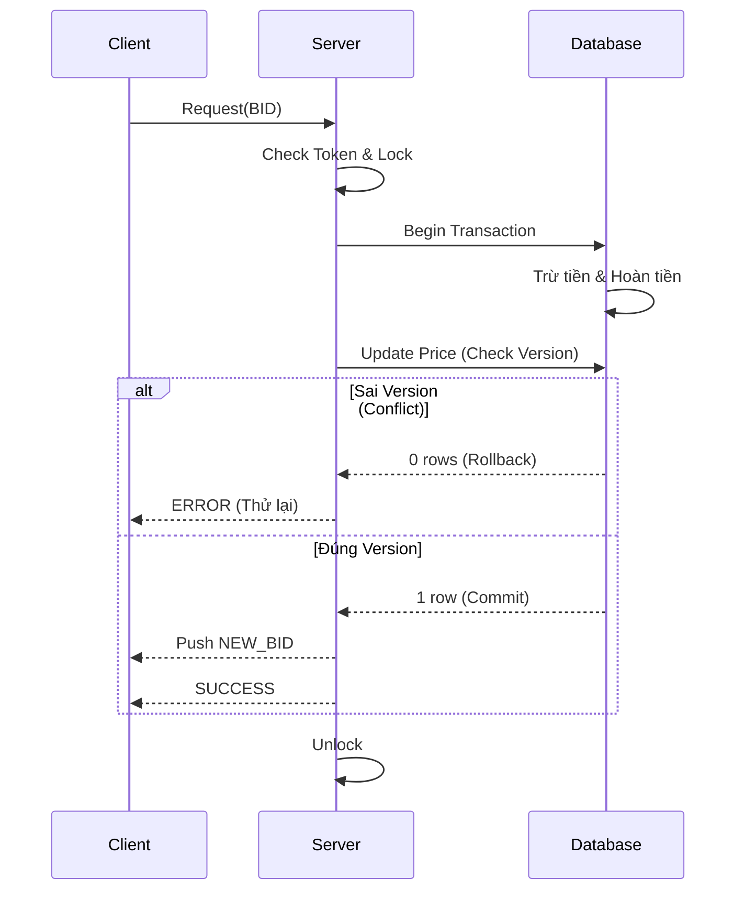

# BÁO CÁO DỰ ÁN: HỆ THỐNG ĐẤU GIÁ TRỰC TUYẾN

**Tài liệu Thiết kế Hệ thống (Enterprise-Grade Online Auction System)**

## TÓM TẮT DỰ ÁN

Dự án phát triển một nền tảng đấu giá thời gian thực theo mô hình phân tán Client-Server. Hệ thống không chỉ xử lý các chức năng CRUD cơ bản mà còn tập trung vào các vấn đề kỹ thuật quan trọng như giao dịch tài chính ACID, xử lý đồng thời, tối ưu tốc độ phản hồi và khả năng tự phục hồi khi mất kết nối.

## 1. Giới thiệu mục tiêu và phạm vi thực hiện

### 1.1. Mục tiêu cốt lõi

Xây dựng một hệ thống đấu giá trực tuyến minh bạch, chống gian lận và có khả năng mở rộng. Hệ thống cần xử lý được tình huống nhiều người dùng cùng đặt giá trong thời điểm cuối phiên mà không gây sai lệch dữ liệu hoặc dòng tiền.

### 1.2. Phạm vi công nghệ và nghiệp vụ

- **Client:** Ứng dụng JavaFX, giao diện desktop, cập nhật dữ liệu realtime, có biểu đồ giá và thông báo.
- **Server:** Java Socket Server đa luồng, xử lý nghiệp vụ tập trung, giao tiếp với MySQL thông qua DAO.
- **Database:** MySQL lưu người dùng, sản phẩm, phiên đấu giá, lịch sử đặt giá, ví tiền, chat và đánh giá.
- **Nghiệp vụ nâng cao:** Auto-bid, Dutch Auction, Trending Lots, Watchlist, Chat, Rating, Admin Dashboard, Heartbeat/Reconnect.

## 2. Kiến trúc tổng thể hệ thống

Hệ thống được thiết kế theo kiến trúc nhiều tầng, kết hợp Client-Server, Command Dispatcher Pattern và Event-Driven Architecture.

```text
Client JavaFX
    |
    | TCP Socket / JSON
    v
Server
    |
    v
AuctionManager
    |
    v
DAO & MySQL
```

### Mô tả kiến trúc

- **Client JavaFX:** Hiển thị giao diện, nhận thao tác người dùng, gửi request đến server và cập nhật UI khi có sự kiện mới.
- **Server:** Nhận request từ nhiều client, phân phối đến handler tương ứng, kiểm tra quyền và xử lý nghiệp vụ.
- **AuctionManager:** Điều phối các nghiệp vụ đấu giá, đặt giá, chốt phiên, xử lý đồng thời và thông báo realtime.
- **DAO & MySQL:** Lưu trữ dữ liệu lâu dài, đảm bảo tính toàn vẹn giao dịch.

### Điểm kỹ thuật nổi bật

- Giao tiếp qua TCP Socket và JSON.
- Mỗi request được điều phối qua `ActionRegistry`/handler riêng.
- Push realtime cho client khi có bid mới hoặc phiên đấu giá thay đổi trạng thái.
- Dùng `CopyOnWriteArrayList` để broadcast an toàn khi nhiều client kết nối/ngắt kết nối.

## 3. Các tính năng Advanced và kỹ thuật cốt lõi

### 3.1. Xử lý đồng thời và giao dịch nguyên tử

Hệ thống áp dụng nhiều lớp bảo vệ để tránh lỗi khi nhiều người cùng đặt giá:

1. **Fine-grained Locking:** Dùng `ReentrantLock` theo từng sản phẩm, giúp chỉ khóa sản phẩm đang được đặt giá, không khóa toàn hệ thống.
2. **Optimistic Locking:** Bảng `items` dùng trường `version`; khi cập nhật giá có điều kiện `WHERE id = ? AND version = ?` để tránh Lost Update.
3. **Transactional DAO:** Các bước trừ tiền, hoàn tiền, ghi log và cập nhật giá nằm trong cùng một transaction. Nếu lỗi thì rollback toàn bộ.



### 3.2. Thuật toán và cấu trúc dữ liệu tối ưu

- **Trending Lots:** Tính độ nổi bật của sản phẩm bằng công thức suy giảm mũ, kết hợp số bid và số người tham gia.
- **Trie Autocomplete:** Dùng Trie để tìm kiếm/gợi ý sản phẩm nhanh theo tiền tố.
- **DelayQueue:** Dùng cho chốt phiên tự động, chỉ xử lý khi phiên đến thời điểm kết thúc.
- **PriorityQueue:** Dùng trong Auto-bid để xử lý các mức giá tự động.

### 3.3. Tinh chỉnh nghiệp vụ và giao diện

- Debounce thanh tìm kiếm khoảng 300ms để giảm request thừa.
- Watchlist và trạng thái UI được cache ở client để phản hồi nhanh.
- Hình ảnh sản phẩm/avatar được xử lý center-crop để không bị méo.
- Tác vụ mạng chạy nền, UI cập nhật qua JavaFX thread để tránh treo giao diện.

### 3.4. Các chức năng đạt được theo barem điểm

| Barem đánh giá | Điểm | Chức năng đạt được | Hướng giải quyết | Lý do lựa chọn |
| --- | ---: | --- | --- | --- |
| Xác định và triển khai các lớp chính | 0.5 | Có các lớp `User`, `Bidder`, `Seller`, `Admin`, `Item`, `Electronics`, `Art`, `Vehicle`, `Auction`, `BidTransaction` | Tách lớp dùng chung trong module `auction-shared`, server/client cùng sử dụng model thống nhất | Đúng yêu cầu đề bài, tránh trùng định nghĩa dữ liệu giữa client và server |
| Áp dụng nguyên tắc OOP | 1.0 | Encapsulation, Inheritance, Polymorphism, Abstraction | Dùng abstract class `Entity`, `User`, `Item`; các lớp con kế thừa theo vai trò và loại sản phẩm; dữ liệu truy cập qua getter/setter | Cấu trúc rõ ràng, dễ mở rộng thêm vai trò hoặc loại sản phẩm |
| Áp dụng design pattern phù hợp | 1.0 | Factory, Strategy/Command, Observer/Event-based, Singleton-style manager | `ItemFactory` tạo sản phẩm theo category; `AuctionBidPipeline` chọn chiến lược English/Dutch; `ActionRegistry` điều phối request; realtime notifier push sự kiện cho client | Giảm phụ thuộc giữa các phần, dễ thêm loại đấu giá hoặc request mới |
| Quản lý người dùng, sản phẩm | 1.0 | Đăng ký, đăng nhập, OTP, phân quyền user/admin; thêm/sửa/xóa/xem/lọc sản phẩm | Server xử lý qua các handler/service/DAO; MySQL lưu người dùng và sản phẩm; client JavaFX chỉ gửi request qua Socket | Đảm bảo chỉ server truy cập database, dữ liệu tập trung và dễ kiểm soát quyền |
| Chức năng đấu giá | 1.0 | Đặt giá, kiểm tra giá hợp lệ, cập nhật người dẫn đầu, quản lý ví/giao dịch | `AuctionManager` xử lý bid; validator kiểm tra phiên, giá và số dư; transaction DB trừ tiền, hoàn tiền, ghi log và cập nhật giá | Đảm bảo logic đấu giá đúng và không sai lệch dòng tiền |
| Xử lý lỗi và ngoại lệ | 1.0 | Chặn giá thấp hơn giá hiện tại, chặn bid khi phiên đóng, xử lý lỗi kết nối và dữ liệu | Dùng validator, exception riêng, response lỗi rõ ràng; xử lý `EOFException`; heartbeat/reconnect khi mất kết nối | Tăng độ ổn định, tránh crash server/client và giúp người dùng nhận lỗi dễ hiểu |
| Xử lý đấu giá đồng thời an toàn | 1.0 | Tránh lost update, rollback sai và hai người cùng thắng | Kết hợp `ReentrantLock` theo item, optimistic locking bằng cột `version`, transaction JDBC và rollback khi lỗi | Phù hợp tình huống nhiều bidder đặt giá cùng lúc, bảo toàn kết quả cuối cùng |
| Realtime update | 0.5 | Client đang xem phiên nhận bid mới/trạng thái mới ngay | Server push sự kiện qua Socket; `ClientConnectionHub` quản lý client bằng `CopyOnWriteArrayList`; client cập nhật UI qua router/notification | Không cần polling liên tục, giảm tải server và cập nhật nhanh |
| Thiết kế kiến trúc Client-Server | 0.5 | Client JavaFX, Server Socket, MySQL phía server | Client gửi JSON request qua TCP Socket; server xử lý nghiệp vụ và truy cập DAO/MySQL | Đúng yêu cầu đề bài, tách rõ giao diện, nghiệp vụ và dữ liệu |
| Áp dụng MVC | 0.5 | Client có FXML/controller/service; server có controller/handler/service/DAO/model | JavaFX controller xử lý UI; server controller nhận kết nối, handler xử lý action, DAO làm việc với database | Code dễ bảo trì, mỗi tầng có trách nhiệm riêng |
| Maven/Gradle, convention, mã nguồn sạch | 0.5 | Maven multi-module gồm `auction-shared`, `auction-server`, `auction-client` | Dùng Maven để quản lý dependency, build JAR; chia package theo controller/service/dao/model/ui | Build thống nhất, dễ chạy test và đóng gói |
| Unit Test bằng JUnit | 0.5 | Có test cho logic shared, bidding, concurrency, auto-bid, validation, trending | Viết JUnit ở `auction-shared`, `auction-server`, `auction-client` cho các logic quan trọng | Giảm lỗi hồi quy ở phần đấu giá, tính giá và validate dữ liệu |
| CI/CD cơ bản | 0.5 | Có GitHub Actions build/test tự động | Cấu hình `.github/workflows/build.yml` để chạy build/test khi thay đổi mã nguồn | Giúp phát hiện lỗi build/test sớm khi làm việc nhóm |
| Auto-Bidding | 0.5 | Người dùng đặt giá tối đa, hệ thống tự trả giá | Dùng `AutoBidCoordinator`, `AutoBidRegistration`, `PriorityQueue` và logic không vượt `maxBid` | Đáp ứng chức năng nâng cao, xử lý nhanh nhiều auto-bid cùng lúc |
| Anti-sniping | 0.5 | Gia hạn phiên khi có bid ở thời điểm cuối | Tích hợp kiểm tra thời điểm bid trong luồng đấu giá/chốt phiên và cập nhật lại thời gian kết thúc nếu cần | Tránh người dùng thắng bằng cách đặt giá sát giờ kết thúc |
| Bid History Visualization | 0.5 | Biểu đồ đường giá realtime trong màn hình chi tiết phiên | Client dùng JavaFX LineChart, cập nhật dữ liệu khi nhận bid mới từ server | Người dùng theo dõi diễn biến giá trực quan, không cần refresh |
| Tính năng sáng tạo bổ sung | 0.5 | Dutch Auction, Trending Lots, Trie Autocomplete, Watchlist, Chat, Rating, Notification | Tách thành service/handler/DAO riêng; dùng Trie, DelayQueue, công thức trending và notification center | Tăng trải nghiệm người dùng và thể hiện thêm thuật toán/cấu trúc dữ liệu nâng cao |

Nhìn chung, hệ thống đã bám đầy đủ các nhóm điểm chính trong barem: thiết kế OOP, chức năng cốt lõi, xử lý đồng thời, realtime update, kiến trúc Client-Server/MVC, Maven, JUnit, CI/CD và các chức năng nâng cao. Phần nổi bật nhất là luồng đấu giá được bảo vệ bằng lock, optimistic locking và transaction để đảm bảo kết quả chính xác khi nhiều người đặt giá cùng lúc.

## 4. Phân chia công việc và đóng góp của các thành viên

Dự án được chia thành 4 mảng chính. Mỗi thành viên phụ trách một nhóm chức năng từ thiết kế đến triển khai.

### 4.1. Dương Nguyên Khánh - System Architect & Core Infrastructure

Đảm nhiệm thiết kế hạ tầng mạng, tối ưu thuật toán và xây dựng cơ chế chống chịu lỗi cho server.

- Xây dựng Autocomplete bằng Trie.
- Phát triển Proxy Bidding bằng PriorityQueue.
- Tối ưu chốt phiên bằng DelayQueue.
- Xây dựng Rate Limiting bằng Token Bucket.
- Tích hợp Heartbeat, Auto-Reconnect và Graceful Shutdown.
- Tích hợp MDC Logging và broadcast realtime an toàn.

### 4.2. Nguyễn Bá Nin - Concurrency & Advanced Business Logic

Đảm nhiệm xử lý đồng thời, toán học hóa nghiệp vụ và các luồng logic phức hợp.

- Xử lý Race Condition bằng `ReentrantLock`.
- Áp dụng Optimistic Locking bằng cột `version`.
- Thiết kế Dutch Auction với Instant Resolution.
- Phát triển Trending Lots bằng Exponential Decay.
- Xây dựng Ban Cascade để thu hồi giao dịch và hoàn tiền khi tài khoản bị khóa.
- Áp dụng Idempotency và `AtomicLong` trong xử lý bất đồng bộ.

### 4.3. Nguyễn Trọng Nhân - Frontend Architect & Data Visualization

Đảm nhiệm giao diện, xử lý bất đồng bộ phía client và trực quan hóa dữ liệu.

- Thiết kế giao diện JavaFX/Glassmorphism.
- Tối ưu Non-blocking UI bằng background thread và `Platform.runLater`.
- Xây dựng Watchlist đồng bộ qua `ClientSession`.
- Tích hợp Real-time Price Chart và dashboard thống kê.
- Áp dụng Debouncing cho thanh tìm kiếm.
- Xử lý Viewport Cropping cho hình ảnh.

### 4.4. Nguyễn Anh Tuấn - Security, Auction Core Flow, Realtime Communication & Database

Đảm nhiệm bảo mật hệ thống, luồng tài chính cốt lõi, cơ sở dữ liệu và hệ sinh thái tương tác người dùng.

- Băm mật khẩu SHA-256, OTP Email bất đồng bộ và RBAC.
- Xử lý English Auction và ví tiền ảo với các trạng thái Deposit, Hold, Refund, Sold.
- Xây dựng Global Chat, Private Chat 1-1 và quản lý bạn bè.
- Chỉnh sửa, cài đặt và tối ưu cơ sở dữ liệu.
- Tích hợp OS-level Notification.
- Xử lý `EOFException` khi client ngắt kết nối đột ngột.
